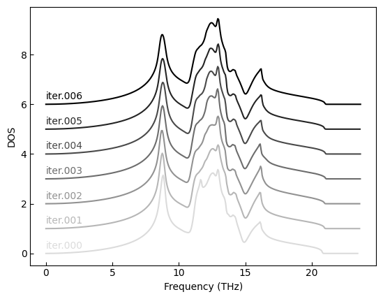

sTDEP for MgO
===

This example shows how to perform statistical sampling for rock salt MgO at 300K.

This tutorial assumes that you are already familiar with the [sTDEP sampling scheme](../../sTDEP/README.md).

To speed up things we provide a machine-learning potential so calculate forces. This potential is introduced [in a dedicated tutorial](../../../00_preparation/potential_energy_surfaces/README.md).

## Prerequisites

- [TDEP is installed](https://github.com/tdep-developers/tdep/blob/main/INSTALL.md)
- [TDEP tools are installed](https://github.com/flokno/tools.tdep)
- [you are familiar with using the so3krates force field (or have your own potential at hand)](https://github.com/tdep-developers/tdep-tutorials/tree/main/00_preparation/potential_energy_surfaces)

## Steps

1. Go to the folder `sampling.300K/iter.000` to start the sampling

2. Check the `Makefile` and the target `init`

3. `make init` to create the first 4 samples at target temperature of 300K:

   ```bash
   canonical_configuration -n 4 -t 300 -mf 20 --quantum
   ```

   this will create 4 samples at a temperature of 0K assuming a maximum frequency (`-mf`) of 20 THz – just a rough guess. This could also be just a single sample in the beginning, it should not matter too much.

4. To keep things organized, we move everything into a folder `samples`, there's a script in `tdeptools` to do that:
   ```bash
    tdep_create_sample_folders contcar_conf*
   ```

   will create `samples.sample.00001` etc and convert the input file from VASP input to `--format` using ASE. Per default this is FHI-aims `geometry.in` files, but could be anything else if you prefer another code.

5. Now compute the forces with
   ```bash
   sokrates_compute --folder-model ../../module/ samples*/*/geometry.in --tdep
   ```

   this will use the [So3krates potential](../../00_preparation/potential_energy_surfaces/README.md) to compute forces for the samples and create TDEP input files automagically.

6. Now we can extract the forceconstants with
   ```bash
   extract_forceconstants -rc2 10 | tee extract_forceconstants.log
   ```

7. Create phonon dispersion and plot:
   ```bash
   ln -sf outfile.forceconstant infile.forceconstant
   phonon_dispersion_relations -p
   gnuplot -p outfile.dispersion_relations.gnuplot_pdf
   ```

8. Inspect the phonon dispersion.

9. Create the phonon DOS and plot:
   ```bash
   phonon_dispersion_relations --dos
   tdep_plot_dos outfile.phonon_dos.hdf5
   ```

   and inspect it.

10. Now create the next iteration. There is a script in `tdeptools` that does everything automatically for you:
   ```bash
   tdep_create_next_iteration -T 0
   ```

   will create the samples and move them to a folder `iter.001`. Note that it will generally create twice as many samples for the next iteration, to be precise: 4, 8, 16, 32, …, based on the current iteration (inferred from the folder name, i.e., `iter.000` for the initial guess, then `iter.001` for the first real iteration, then `iter.002`, you get the point). The maximal number of samples is set to 512, but that can be adjusted. Together with re-using the previous samples (see below), this is the best sampling scheme in our experience. Feel free to prove us wrong and find a better one!

11. Coming back to topic: Move this folder to your root directory and move to it
    ```bash
    mv iter.001 ..
    cd ../iter.001
    ```

12. To reuse the samples from the previous iteration, use
    ```bash
    tdep_ln_previous_samples
    ```

    this will link the folder `../iter.000/samples` to `samples_prev`. Reusing samples from the previous iteration can be viewed as a simple mixing scheme and is generally recommended.

13. Now we can repeat from step 5 until convergence.

Please note that there is a makefile that summarizes each of the steps, once you feel confident try to understand the targets and simply use those via, e.g., `make infile.forces`, or `make iteration` to create an entire step.

## Convergence

- At each iteration, `canonical_configuration` is used and its output is saved to `canonical_configuration.log`. Inspect how in particular the mean-square displacement changes from iteration to iteration

- Observe how the dispersion converges more and more.

- Plot the phonon DOS per iteration, you can do that with the script `plot_dos_convergence.py`:
  ```bash
  python plot_dos_convergence.py iter.*/outfile.phonon_dos
  ```
  
  This should create a plot similar to this: 
  
  

**When are you converged?**
