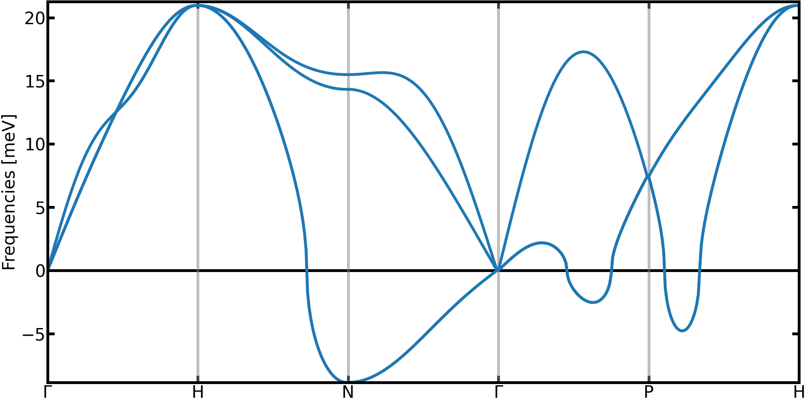
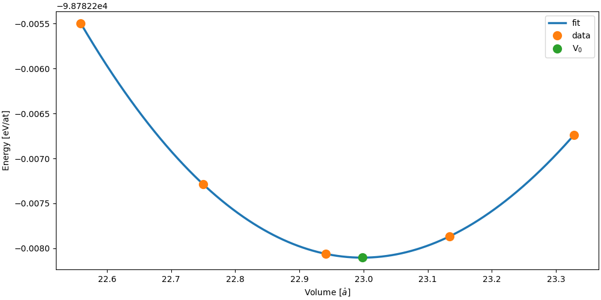

Thermodynamics with TDEP
========================

The free energy is a central property in statistical physics that allows to access to the stability of a structure, find its equilibrium volume, compute phase diagrams and many other things.
For an arbitrary system with a potential $V(\vec{R})$, the free energy is very difficult to compute and requires complex and expensive method.

Fortunately, in the harmonic approximation, the free energy can computed exactly using the phonon density of states defined as:
```math
g(\omega) = \sum_\lambda \delta(\omega - \omega_\lambda)
```

For instance, the harmonic free energy $\mathcal{F}_0$ is computed by integrating this density of states with the free energy of each phonons modes
```math
\mathcal{F}_0 = k_BT \int_0^\infty d\omega g(\omega) \ln\big[2 \sinh(\frac{\hbar\omega}{2k_BT}\big] 
```
Consequently, the free energy of the system at any temperature can be obtained using this formula with a given set of phonons.
However, by definition, the harmonic approach is missing the **anharmonic** contribution, which can dramatically modify the thermodynamic of the sytem.

Fortunately TDEP is able to bring some corrections that include part of the anharmonicity [Ref. 2].
For given volume and temperature, and staying at the second order in the force constants, the TDEP free energy $\mathcal{F}^{\mathrm{TDEP}}$ is given by
```math
\mathcal{F}^{\mathrm{TDEP}}(T) = \mathcal{F}_0^{\mathrm{TDEP}}(T) + < V(\vec{R}) - V^{\mathrm{TDEP}}(\vec{R}) >_T
```
In this equation
- $\mathcal{F}_0^{\mathrm{TDEP}}$ is the effective harmonic free energy.
- $V(\vec{R})$ is the potential energy of the system (given for example by DFT).
- $V^{\mathrm{TDEP}}(\vec{R})$ is the potential energy of the effective harmonic model.
- $< O >_T$ indicate an average of $O$ computed at a temperature T.

Compared to the harmonic approximations, two corrections are to be observed
* The temperature dependence of the phonons -> that will bring a modification of the $\mathcal{F}_0(T)$
* The $U_0 = < V(\vec{R}) - V^{\mathrm{TDEP}}(\vec{R}) >_T$ term -> a anharmonic correction

In this tutorial, we will have a look on the convergence of both contributions.
An important thing to have in mind, is that both will have a different rate of convergence.
The harmonic harmonic free energy is computed using the interatomic force constants. For each configurations, $3 N_{\mathrm{at}}$ data point will contribute to the computation of the force constants, hence to the computation of $\mathcal{F}_0^{\mathrm{TDEP}}$
On the contrary, a configuration gives only one value to contribute to the $U_0$ correction term.
As we will see, this difference is important in the convergence of the total free energy !


It should be noted that the free energy computed this way is still an approximation.
However, compared to the harmonic approximation, explicit temperature effect are included.
Moreover, if using the self-consistent stochating sampling with a Bose-Einstein distribution (see tutorial on stochastic sampling) this approach allows to include nuclear quantum effects.


**Important Note**

To generate configurations used in TDEP, we have two approaches :
- Using molecular dynamics to sample the true (but classical) distribution (MD-TDEP)
- Using the self-consistent stochastic approach (sTDEP)

[sTDEP is an application of the self-consistent harmonic approximation, constructed on an inequality called the Gibbs-Bogoliubov.](https://github.com/flokno/notes/blob/main/tdep/note_tdep_self-consistent-sampling.md)
This inequality tells us that the sTDEP free energy is an **upper-bound** to the free energy : $\mathcal{F} \leq \mathcal{F}^{\mathrm{sTDEP}}$

On the contrary, using the real distribution, MD-TDEP gives a **lower-bound** to the free energy : $\mathcal{F} \geq \mathcal{F}^{\mathrm{MD-TDEP}}$

In the end, the real free energy is framed by the approximated free energy computed with each approach
```math
\mathcal{F}^{\mathrm{MD-TDEP}} \leq \mathcal{F} \leq \mathcal{F}^{\mathrm{sTDEP}}
```

But be careful ! When comparing the free energy of two phases, to compute phase diagram for example, you have to use **the same approximation** for both phase !

**Important Note 2**

The free energy computed with imaginary mode has no physical meaning !
Always check the dispersion relation before even thinking about computing thermodynamic properties !

## General scope

This tutorial covers:

1. Obtaining the effective harmonic free energy as well as the $U_0$ correction
2. Converging the free energy when using stochastic sampling
3. Computing equilbrium volumes at finite temperature using the equation of state fitting method


The end goal of this tutorial is to compute the lattice parameter of bcc Zr at 1300K.
According to the harmonic approximation, the bcc phase of zirconium present several imaginary modes, which indicates the unstability of the phase.
<p align="center">
	
  <figcaption><center><em>Phonons in bcc Zr in the harmonic approximation.</a></em></center></figcaption>
</p>
However, it is well documented that zirconium is in a bcc phase at high temperature and ambient pressure, showing thus a limitation of the harmonic approximation.
The stabilization of zirconium can be explained through explicit temperature effects that can be caputred by the TDEP approach [Ref. 1].

When computing properties at finite temperature, thermal expansion can have a significant impact, thus making the prediction of the equilibrium volume an important step.
When working at 0K, the equilibrium volume can be computed using a model equation of state to fit potential energy vs volume data.
For example, here is the equation of state of bcc Zirconium fitted with the Vinet model.
<p align="center">
	
  <figcaption><center><em>Equation of state of bcc Zr computed without effects of temperature.</a></em></center></figcaption>
</p>

To include the effects of temperature, we can use the equation of state method, but replacing the energy by the free energy in the fitting.
This is the final goal of this tutorial.

We will need to perform simulations for several volumes, with reference data that will be available in the `example_Zr` directory.


- You will find informations concerning free energy on [`extract_forceconsants`](http://ollehellman.github.io/program/extract_forceconstants.html) and [`phonon_dispersions`](https://ollehellman.github.io/program/phonon_dispersion_relations.html#sec_tdepthermo)


## Computing the free energy

As a start, we will compute the free energy of bcc zirconium with a lattice parameter of 3.61 $\mathring{a}$.
In the `example_Zr` folder, you will find a subdirectory `sampling.1300K` which contains subfolders `aX`, where X is a number giving the lattice parameter.
For the 12th iteration of the `a3.61` folder, all the input files necessary to compute the free energy with TDEP.
Note that the configurations were generated using the self-consistent stochastic approach using the `generate_configuration` binary at a temperature of 1300 K.

- Go into the `example_Zr/sampling.1300K/a3.61/iter.012` folder or copy the data in a new folder.
- Compute the force constants using the command: `extract_forceconstants -rc2 10.0 -U0`
- Compute the phonon dispersion with the command: `phonon_dispersions --dos --temperature 1300`. This command will compute the phonon dispersion, the density of state and compute thermodynamic properties at a temperature of 1300 K. **For consistency, it is important to compute thermodynamic properties at the temperature at which the configurations were generated !**
    - In the directory, you should find two files related to thermodynamic properites: `outfile.free_energy` and `outfile.U0` 
    - In the first one, obtained due to the use of the `--temperature` options of `phonon_dispersions`, you will find 4 values :
        1. The temperature
        2. The harmonic free energy, in eV/atom
        3. The harmonic entropy, in ev/K/atom
        4. The harmonic heat capacity in eV/K/atom
    - The second one has been activated with the `--U0` options of `extract_forceconstants` and contains the $U_0$ correction to the harmonic free energy
        1. The average potential energy, in eV/atom
        2. The $U_0$ correction at second order, which is equal to `<V(R) - V_2(R)>`, in eV/atom.
        3. The $U_0$ correction at third order, which is equal to `<V(R) - V_2(R) - V_3(R)>`, in eV/atom. Note that it will be equal to the second order correction if you didn't extract third order force constants
        3. The $U_0$ correction at fourth order, which is equal to `<V(R) - V_2(R) - V_3(R)>`, in eV/atom. Note that it will be equal to the second order correction if you didn't extract fourth order force constants
    - To get the free energy with the second order correction, you just have to add the harmonic free energy and the second order correction in `outfile.U0` (the second value). 
    The resulting free energy will be in eV/atom.

- Try to converge the value of the harmonic free energy and the $U_0$ correction. For this, you have several parameters to control
    1. The number of samples
    2. The cutoff for the force constants
    3. The q-point grid used to compute the harmonic properties. The grid can be controlled with the `--qg` option of the `phonon_dispersions` binary. For example, you can try
    `phonon_dispersion_relation --dos --temperature 1300 -qg 10 10 10`
    - Each of these parameters will have a different influence on the free energy. For instance, the $U_0$ value is computed using the potential energy of each configuration. This means that contrary to the force constants, which benefit from $3 \times N_{\mathrm{at}}$ values per configurations, only one data point is added to the average per configurations. **Try to observe the effect of each of the parameter on the convergence of the $U_0$ and the harmonic free energy**. 
    - To simplify the convergence, it's a good idea to start with the number of samples. Indeed, this step is the most computationaly demanding (as it demand calculation of energy and forces !). Once this is done, you can look at the cutoff convergence and finish with q-point grid. 

Remember to rename the outfile.X before launching tdep again !
**Note** For the final steps of this tutorial, we will need the `outfile.U0` and `outfile.free_energy` files inside this folder. Don't erase them !

## Practical example on the free energy convergence

To grasp a better idea on how to converge the free energy, let's have a look at its computation from the start, using stochastic sampling.
For the lattice parameter of 3.63 $\mathring{a}$, the self-consistent sampling have not been done, and we will do it now.
In the `example_Zr/sampling.1300K/a3.63` folder, you will find everything needed to perform a self-consistent simulation of bcc Zr at 1300K.
If you need help on how to do so, don't hesitate to look back at the 01_sampling tutorial.

When doing the iterations, look at the evolution of the harmonic free energy, $U_0$ correction term and the total free energy.
Try to make the free energy converge to 1 meV/at.

It's always a good practice to use previous force constants close to the desired conditions (temperature/volume) when available !
With this, you can bypass the first iterations and already start with a larger number of configurations.
For this example, since you've already computed force constants at 1300K, you can use them to start your sampling at 1100K.

The steps to do the stochastic sampling are :
1. Go to the folder `example_Zr/sampling.1300K/a3.63/iter.005` to start the sampling
2. Copy the `infile.forceconstant` file from your previous calculation to the folder.
3. Check the `Makefile` and the target `init`. You should see the absence of the `-mf` variable since you are already starting with a `infile.forceconstant`.
4. `make init` to create the first 128 samples
5. compute the forces with `make compute`, this will use the So3krates potential to compute forces for the samples and create TDEP input files
6. now we can extract the forceconstants → `make fc`
7. inspect the phonon dispersion
8. create the next iteration from the current set of force constants, `make iteration`
9. move the folder `iter.006` down and `cd` there
10. repeat until convergence


Things to look out for
- At each iteration, the harmonic free energy and the U0 correction term are computed. Plot their evolution with the number of configurations !
- After how many iteration does the total free energy stabilize ? Is it the same as for the phonon dispersion stabilization ?


**Note** For the final steps of this tutorial, we will need the `outfile.U0` and `outfile.free_energy` files inside the folder `iter.XXX`. Don't erase them !

## Getting the equilibrium volume

Now that the free energy for every volume has been computed, we can finally compute the equilibrium volume.

1. Choose an iteration
2. Extract the total free energy of each volume at this iteration, and put it in a `eos_data.dat` file. For this, you can modify and use the `get_eos_data.py` script.
3. Fit a Vinet equation of state using the `fit_eos.py` script. Note that because of statistical noise, the fit might not work for some iterations without enough data !
4. Repeat for a different iteration.


Things to look out for
- Observe how the fitted volume (and lattice parameter) evolve with the number of iterations.
- How many iterations are necessary to converge the volume of this system at this temperature ?
- Compare your result to the lattice parameter computed at 0K (3.58 angstrom). (Note : the lattice parameter for a bcc crystal is given by $a = (2 V)^{1/3}$ with $V$ the volume.)

## Suggested reading

- [[1] O. Hellman, I. A. Abrikosov, and S. I. Simak Phys. Rev. B **84**, 180301\(R\) (2011)](https://journals.aps.org/prb/abstract/10.1103/PhysRevB.84.180301)
- [[2] O. Hellman, P. Steneteg, I. A. Abrikosov, and S. Simak, Phys. Rev. B **87**, 104111 (2013)](https://journals.aps.org/prb/abstract/10.1103/PhysRevB.87.104111)

## Prerequisites

- [TDEP is installed](http://ollehellman.github.io/page/0_installation.html)
