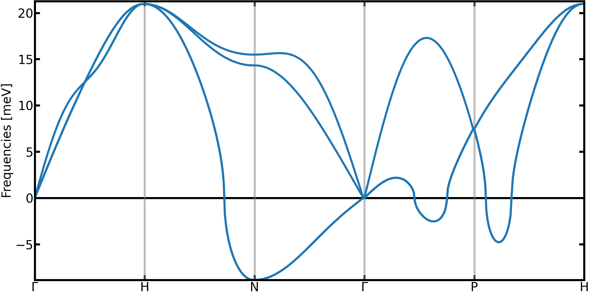
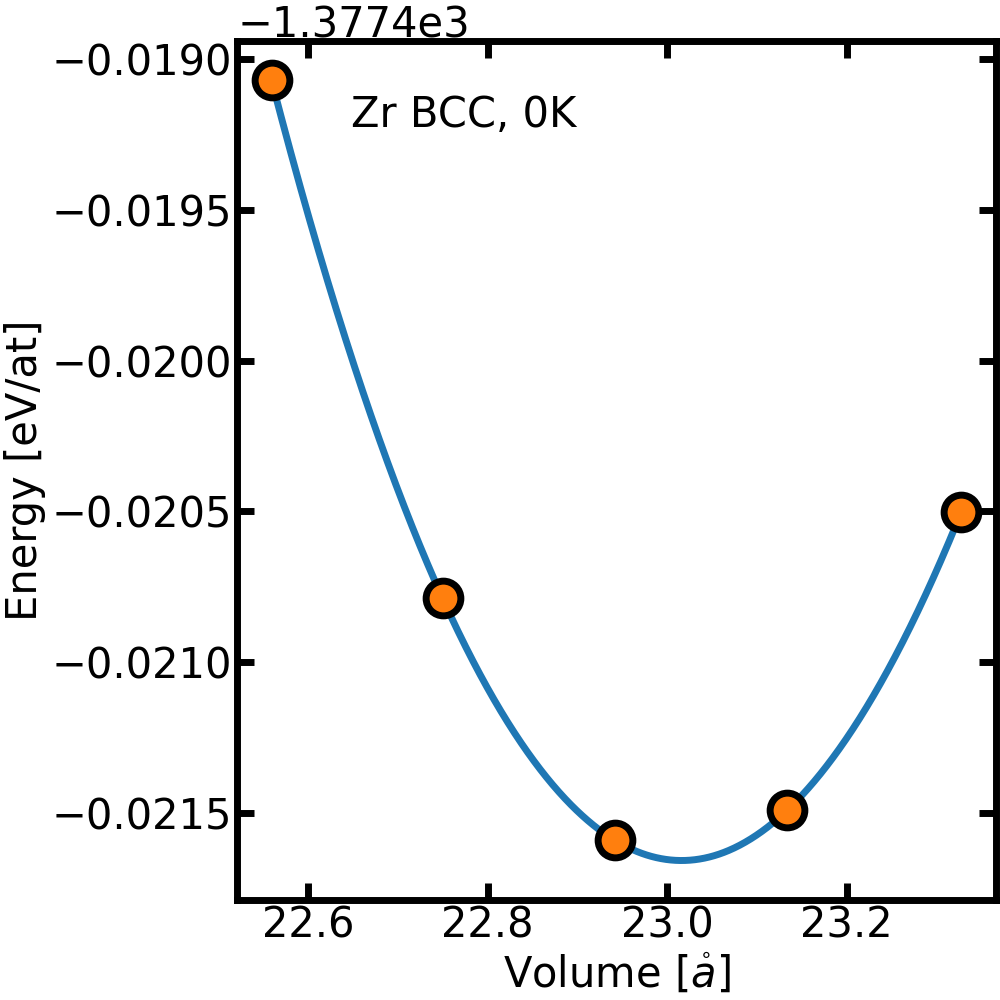

Thermodynamics with TDEP
========================

The free energy is a central property in statistical physics that allows to access to the stability of a structure, find its equilibrium volume, compute phase diagrams and many other things.
For an arbitrary system with a potential $V(\vec{R})$, the free energy is very difficult to compute and requires complex and expensive method.

Fortunately, in the harmonic approximation, the free energy can computed exactly using the phonon density of states defined as:
```math
g(\omega) = \sum_\lambda \delta(\omega - \omega_\lambda)
```

For instance, the harmonic free energy $\mathcal{F}_0$ is computed by integrating this density of states with the free energy of each phonons modes
```math
\mathcal{F}_0 = k_BT \int_0^\infty d\omega g(\omega) \ln\big[2 \sinh(\frac{\hbar\omega}{2k_BT}\big] 
```
Consequently, the free energy of the system at any temperature can be obtained using this formula with a given set of phonons.
However, by definition, the harmonic approach is missing the **anharmonic** contribution, which can dramatically modify the thermodynamic of the sytem.

Fortunately TDEP is able to bring some corrections that include part of the anharmonicity [Ref. 2].
For given volume and temperature, and staying at the second order in the force constants, the TDEP free energy $\mathcal{F}^{\mathrm{TDEP}}$ is given by
```math
\mathcal{F}^{\mathrm{TDEP}}(T) = \mathcal{F}_0^{\mathrm{TDEP}}(T) + < V(\vec{R}) - V^{\mathrm{TDEP}}(\vec{R}) >_T
```
In this equation
- $\mathcal{F}_0^{\mathrm{TDEP}}$ is the effective harmonic free energy.
- $V(\vec{R})$ is the potential energy of the system (given for example by DFT).
- $V^{\mathrm{TDEP}}(\vec{R})$ is the potential energy of the effective harmonic model.
- $< O >_T$ indicate an average of $O$ computed at a temperature T.

Compared to the harmonic approximations, two corrections are to be observed
* The temperature dependence of the phonons -> that will bring a modification of the $\mathcal{F}_0(T)$
* The $U_0 = < V(\vec{R}) - V^{\mathrm{TDEP}}(\vec{R}) >_T$ term -> a anharmonic correction

It should be noted that the free energy computed this way is still an approximation.
However, compared to the harmonic approximation, explicit temperature effect are included.
Moreover, if using the self-consistent stochating sampling with a Bose-Einstein distribution (see tutorial on stochastic sampling) this approach allows to include nuclear quantum effects.


**Important Note**

To generate configurations used in TDEP, we are two approaches :
- Using molecular dynamics to sample the true (but classical) distribution (MD-TDEP)
- Using the self-consistent stochastic approach (sTDEP)

sTDEP is an application of the self-consistent harmonic approximation, constructed on an inequality called the Gibbs-Bogoliubov.
This inequality tells us that the sTDEP free energy is an **upper-bound** to the free energy : $\mathcal{F} \leq \mathcal{F}^{\mathrm{sTDEP}}$

On the contrary, using the real distribution, MD-TDEP gives a **lower-bound** to the free energy : $\mathcal{F} \geq \mathcal{F}^{\mathrm{MD-TDEP}}$

In the end, the real free energy is framed by the approximated free energy computed with each approach
```math
\mathcal{F}^{\mathrm{MD-TDEP}} \leq \mathcal{F} \leq \mathcal{F}^{\mathrm{sTDEP}}
```

But be careful ! When comparing the free energy of two phases, to compute phase diagram for example, you have to use **the same approximation** for both phase !

## General scope

This tutorial covers:

1. Obtaining the effective harmonic free energy as well as the $U_0$ correction
2. Obtaining higher order corrections
3. Comparison of the method of sampling (MD or generate_structure) on the results

This tutorial **does not cover**:

- how to relax a structure,
- how to check symmetry of your structure,
- supercell convergence,


For this tutorial, we will compute the equilibrium lattice parameter of bcc zirconium at 1300K.
According to the harmonic approximation, the bcc phase of zirconium present several imaginary modes, which indicates the unstability of the phase.
<p align="center">
	
  <figcaption><center><em>Phonons in bcc Zr in the harmonic approximation.</a></em></center></figcaption>
</p>
However, it is well documented that zirconium is in a bcc phase at high temperature and ambient pressure, showing thus a limitation of the harmonic approximation.
The stabilization of zirconium can be explained through explicit temperature effects that can be caputred by the TDEP approach [Ref. 1].

We will need to perform simulations for several volumes, with reference data will be available in the `references` directory.


- You will find informations concerning free energy on [`extract_forceconsants`](http://ollehellman.github.io/program/extract_forceconstants.html) and [`phonon_dispersions`](https://ollehellman.github.io/program/phonon_dispersion_relations.html#sec_tdepthermo)


## Computing the free energy

As a start, we will compute the free energy of bcc zirconium at the equilibrium volume obtained from a minimization of the energy.
In the `reference` folder, you will find a subdirectory `V0K`.
This directory contains all the input files necessary to compute the free energy with TDEP.
Note that the configurations were generated using the self-consistent stochastic approach using the `generate_configuration` binary at a temperature of 1300 K.


- Go into the `V0K` folder or copy the data in a new folder.
- Compute the force constants using the command: `extract_forceconstants -rc2 6.0 -U0`
- Compute the phonon dispersion with the command: `phonon_dispersions --dos --temperature 1300`. This command will compute the phonon dispersion, the density of state and compute thermodynamic properties at a temperature of 1300 K. For consistency, it is important to compute thermodynamic properties at the temperature at which the configurations were generated !
    - In the directory, you should find two files related to thermodynamic properites: `outfile.free_energy` and `outfile.U0` 
    - In the first one, obtained due to the use of the `--temperature` options of `phonon_dispersions`, you will find 4 values :
        1. The temperature
        2. The harmonic free energy, in eV/atom
        3. The harmonic entropy, in ev/K/atom
        4. The harmonic heat capacity in eV/K/atom
    - The second one has been activated with the `--U0` options of `extract_forceconstants` and contains the $U_0$ correction to the harmonic free energy
        1. The average potential energy, in eV/atom
        2. The U0 correction at second order, which is equal to `<V(R) - V_2(R)>`, in eV/atom.
        3. The U0 correction at third order, which is equal to `<V(R) - V_2(R) - V_3(R)>`, in eV/atom. Note that it will be equal to the second order correction if you didn't extract third order force constants
        3. The U0 correction at fourth order, which is equal to `<V(R) - V_2(R) - V_3(R)>`, in eV/atom. Note that it will be equal to the second order correction if you didn't extract fourth order force constants
    - To get the free energy with the second order correction, you just have to add the harmonic free energy and the second order correction in `outfile.U0` (the second value). 
    The resulting free energy will be in eV/atom.

- Try to converge the value of the harmonic free energy and the U0 correction. For this, you have several parameters to control
    1. The number of samples
    2. The cutoff for the force constants
    3. The q-point grid used to compute the harmonic properties. The grid can be controlled with the `--qg` option of the `phonon_dispersions` binary. For example, you can try
    `phonon_dispersion_relation --dos --temperature 1210 --unit mev -qg 10 10 10`
    - Each of these parameters will have a different influence on the free energy. For instance, the $U_0$ value is computed using the potential energy of each configuration. This means that contrary to the force constants, which benefit from $3 \times N_{\mathrm{at}}$ values per configurations, only one data point is added to the average per configurations. Try to observe the effect of each of the parameter on the convergence of the $U_0$ and the harmonic free energy. (To change the number of configurations used in the fit, you can change the number of step in the infile.meta file for example.)
    Remember to rename the outfile.X before launching tdep again !

## Getting the equilibrium volume

When computing properties at finite temperature, thermal expansion can have a significant impact, thus making the prediction of the equilibrium volume an important step.
When working at 0K, the equilibrium volume can be computed using a model equation of state to fit potential energy vs volume data.
For example, here is the equation of state of bcc Zirconium fitted with the Vinet model.
<p align="center">
	
  <figcaption><center><em>Equation of state of bcc Zr computed without effects of temperature.</a></em></center></figcaption>
</p>

To include the effects of temperature, we can use the equation of state method, but replacing the energy by the free energy in the fitting.


In the `reference` folder, you will find a subdirectory `equation_of_state` which contains subfolders `aX`, where X is a number giving the lattice parameter.
In these subfolder, you will find some input files with data computed at 1300K with the corresponding lattice parameter.
- For each lattice parameter, compute the free energy. Look carefuly at the convergence for `U0` and the harmonic free energy.
- Put volume/energy data (in $\mathring{a}^3/at$ and eV/at) in a file `eos_data.dat` to allow for the fitting.
- Fit an equation of state using the Vinet equations on the free energy. For this, you can use the script `fit_equation_of_state.py` in the `reference` folder, that can fit a Vinet equation of state from the file `eos_data.dat`.
- Extract the lattice parameter of bcc Zr at this temperature from your fit. Compare it with the lattice parameter obtained from the minimization of the potential energy (a = 3.58$~\mathring{a}$. Note : for a monoatomic bcc crystal, the lattice parameter is given by $a = (2 V)^{1/3}$).


## Suggested reading

- [[1] O. Hellman, I. A. Abrikosov, and S. I. Simak Phys. Rev. B **84**, 180301\(R\) (2011)](https://journals.aps.org/prb/abstract/10.1103/PhysRevB.84.180301)
- [[2] O. Hellman, P. Steneteg, I. A. Abrikosov, and S. Simak, Phys. Rev. B **87**, 104111 (2013)](https://journals.aps.org/prb/abstract/10.1103/PhysRevB.87.104111)

## Prerequisites

- [TDEP is installed](http://ollehellman.github.io/page/0_installation.html)
