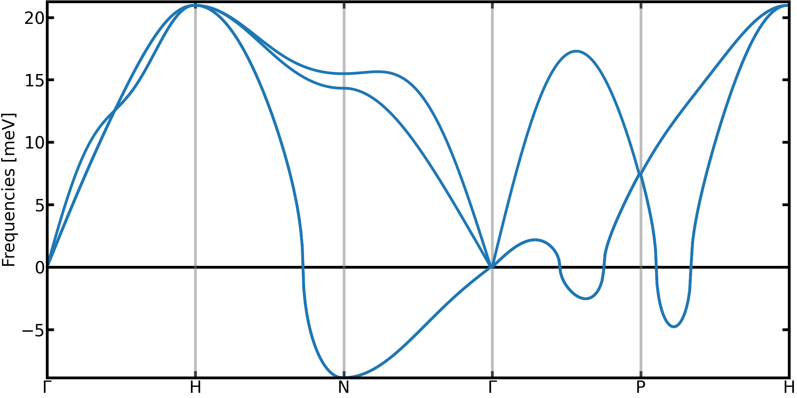
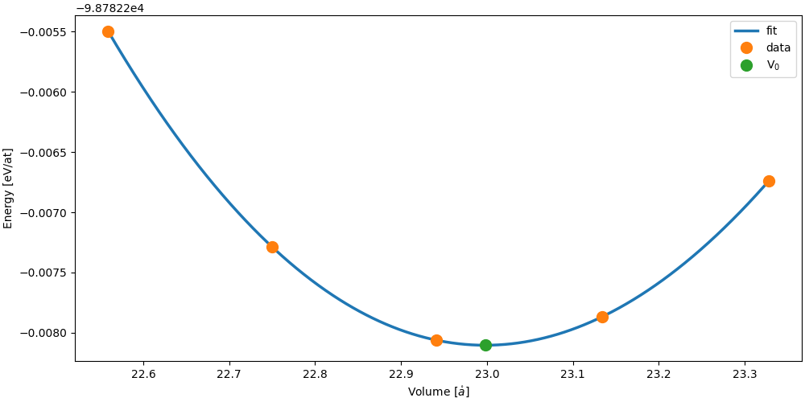

Thermodynamics with TDEP
========================

The free energy is a central property in statistical physics that allows to access to the stability of a structure, find its equilibrium volume, compute phase diagrams and many other things.
For an arbitrary system with a potential $V(\vec{R})$, the free energy is very difficult to compute and requires complex and expensive method.

Fortunately, in the harmonic approximation, the free energy can computed exactly using the phonon density of states defined as:
```math
g(\omega) = \frac{(2\pi)^3}{V} \int_{\mathrm{BZ}} \delta(\omega - \omega_{q,s}) dq
```

For instance, the harmonic free energy $\mathcal{F}_0$ is computed by integrating this density of states with the free energy of each phonons modes
```math
\mathcal{F}_0 = k_BT \int_0^\infty d\omega g(\omega) \ln\big[2 \sinh(\frac{\hbar\omega}{2k_BT})\big] 
```
Consequently, the free energy of the system at any temperature can be obtained using this formula with a given set of phonons.
However, by definition, the harmonic approach is missing the **anharmonic** contribution, which can dramatically modify the thermodynamics of the sytem.

Fortunately TDEP is able to bring some corrections that include part of the anharmonicity [Ref. 2].
For given volume and temperature, and staying at the second order in the force constants, the TDEP free energy $\mathcal{F}^{\mathrm{TDEP}}$ is given by
```math
\mathcal{F}^{\mathrm{TDEP}}(T) = \mathcal{F}_0^{\mathrm{TDEP}}(T) + < V(\vec{R}) - V^{\mathrm{TDEP}}(\vec{R}) >_T
```
In this equation
- $\mathcal{F}_0^{\mathrm{TDEP}}$ is the effective harmonic free energy.
- $V(\vec{R})$ is the potential energy of the system (given for example by DFT).
- $V^{\mathrm{TDEP}}(\vec{R})$ is the potential energy of the effective harmonic model.
- $< O >_T$ indicate an average of $O$ computed at a temperature T.

Compared to the harmonic approximation, two corrections are to be observed
* The temperature dependence of the phonons -> that will bring a modification of the $\mathcal{F}_0(T)$
* The $U_0 = < V(\vec{R}) - V^{\mathrm{TDEP}}(\vec{R}) >_T$ term -> a anharmonic correction

In this tutorial, we will have a look on the convergence of both contributions.
An important thing to have in mind, is that both will have a different rate of convergence.
The harmonic free energy is computed using the interatomic force constants. For each configurations, $3 N_{\mathrm{at}}$ data point will contribute to the computation of the force constants, hence to the computation of $\mathcal{F}_0^{\mathrm{TDEP}}$
On the contrary, a configuration gives only one value to contribute to the $U_0$ correction term.
As we will see, this difference is important in the convergence of the total free energy !


It should be noted that the free energy computed this way is still an approximation.
However, compared to the harmonic approximation, explicit temperature effect are included.
Moreover, if using the self-consistent stochating sampling with a Bose-Einstein distribution (see tutorial on stochastic sampling) this approach allows to include nuclear quantum effects.


**Important Note**

To generate configurations used in TDEP, we have two approaches :
- Using molecular dynamics to sample the true (but classical) distribution (MD-TDEP)
- Using the self-consistent stochastic approach (sTDEP)

[sTDEP is an application of the self-consistent harmonic approximation, constructed on an inequality called the Gibbs-Bogoliubov.](https://github.com/flokno/notes/blob/main/tdep/note_tdep_self-consistent-sampling.md)
This inequality tells us that the sTDEP free energy is an **upper-bound** to the free energy : $\mathcal{F} \leq \mathcal{F}^{\mathrm{sTDEP}}$

On the contrary, using the real distribution, MD-TDEP gives a **lower-bound** to the free energy : $\mathcal{F} \geq \mathcal{F}^{\mathrm{MD-TDEP}}$

In the end, the real free energy is framed by the approximated free energy computed with each approach
```math
\mathcal{F}^{\mathrm{MD-TDEP}} \leq \mathcal{F} \leq \mathcal{F}^{\mathrm{sTDEP}}
```

But be careful ! When comparing the free energy of two phases, to compute phase diagram for example, you have to use **the same approximation** for both phases !

**Important Note 2**

The free energy computed with imaginary mode has no physical meaning !
Always check the dispersion relation before even thinking about computing thermodynamic properties !

## General scope

This tutorial covers:

1. Obtaining the effective harmonic free energy as well as the $U_0$ correction
2. Converging the free energy when using stochastic sampling
3. Computing equilbrium volumes at finite temperature using the equation of state fitting method


The end goal of this tutorial is to compute the lattice parameter of bcc Zr at 1300K.
According to the harmonic approximation, the bcc phase of zirconium present several imaginary modes, which indicates the unstability of the phase.
<p align="center">
	
  <figcaption><center><em>Phonons in bcc Zr in the harmonic approximation.</a></em></center></figcaption>
</p>
However, it is well documented that zirconium is in a bcc phase at high temperature and ambient pressure, showing thus a limitation of the harmonic approximation.
The stabilization of zirconium can be explained through explicit temperature effects that can be captured by the TDEP approach [Ref. 1].

When computing properties at finite temperature, thermal expansion can have a significant impact, thus making the prediction of the equilibrium volume an important step.
When working at 0K, the equilibrium volume can be computed using a model equation of state to fit potential energy vs volume data.
For example, here is the equation of state of bcc Zirconium fitted with the Vinet model.
<p align="center">
	
  <figcaption><center><em>Equation of state of bcc Zr computed without effects of temperature.</a></em></center></figcaption>
</p>

To include the effects of temperature, we can use the equation of state method, but replacing the energy by the free energy in the fitting.
This is the final goal of this tutorial.

We will need to perform simulations for several volumes, with reference data that will be available in the `example_Zr` directory.


- You will find informations concerning free energy on [`extract_forceconsants`](http://ollehellman.github.io/program/extract_forceconstants.html) and [`phonon_dispersions`](https://ollehellman.github.io/program/phonon_dispersion_relations.html#sec_tdepthermo)


## Computing the Free Energy (basic example)

To start, we will compute the free energy of BCC zirconium with a lattice parameter of 3.61 $\mathring{A}$.
In the `example_Zr` folder, you will find a subdirectory `sampling.1300K` which contains subfolders `aX`, where X is a number giving the lattice parameter.
For the 12th iteration of the `a3.61` folder, we have generated all the necessary input files to compute the free energy with TDEP. **Note that the configurations were generated using the self-consistent stochastic approach using the [`canonical_configuration`](https://tdep-developers.github.io/tdep/program/canonical_configuration/) binary at a temperature of 1300 K.**

1. Change directory to `example_Zr/sampling.1300K/a3.61/iter.012` or copy the data to a new folder.
2. Compute the second-order force constants and re-name the output to use the IFCs as input for the next iteration. This command should take about 5 seconds to run and will generate the `outfile.forceconstant` and `outfile.U0` files.
```
extract_forceconstants -rc2 10.0 -U0
mv outfile.forceconstant infile.forceconstant
```
Expected U0:
```sh
    BASELINE ENERGY (eV/atom):
        U0:             -98782.253022
```
3. Compute the phonon dispersion, density of states and other (harmonic) thermodynamic properties at 1300K. This should take about 1 second and will generate the `outfile.free_energy` file. **For consistency, it is important to compute thermodynamic properties at the temperature at which the configurations were generated !**
```sh
phonon_dispersion_relations --dos --temperature 1300
```
Expected Output:
```sh
T(K)     F(eV/atom)         S(eV/K/atom)       Cv(eV/K/atom)
1300.00000 -0.73434817276E+00  0.82376351069E-03  0.25815978923E-03
```

We now have all we need to compute the TDEP free energy! The `oufile.free_energy` contains harmonic free energy (column 2) and the `outfile.U0` contains the temperature dependent estimate of $U_0$. To get the free energy with the second order correction, you just have to add the harmonic free energy in `outfile.free_energy` and the second order correction in `outfile.U0` (the second value). The `outfile.U0` will also contain high-order corrections, but since our reference free energy is from a harmonic system we can only use the harmonic correction for $U_0$. The resulting free energy will be in eV/atom.

In this case $F_{\text{TDEP}} = \langle V(R) - V_2(R) \rangle + F_{\text{vib}} = U_0 + F_{\text{vib}}$ = .


## Free Energy Convergence

To better understand the free energy convergence, we will perform the computation from the start, using stochastic sampling.
For the lattice parameter of 3.63 $\mathring{a}$, the self-consistent sampling has not been done, and we will do it now.
In the `example_Zr/sampling.1300K/a3.63` folder, you will find everything needed to perform a self-consistent simulation of bcc Zr at 1300K. If you need help on how to do so, don't hesitate to look back at the 02_sampling tutorial.

When doing the iterations, look at the evolution of the harmonic free energy, $U_0$ correction term and the total free energy.
Try to make the free energy converge to tolerance of 1 meV/atom.

It's always a good practice to use previous force constants close to the desired conditions (temperature/volume) when available !
With this, you can bypass the first iterations and already start with a larger number of configurations. In this instance, we have provided force constants from the a3.61 as a starting point.

The steps to do the stochastic sampling are very similar to the 02_sampling tutorial:
1. Go to the folder `example_Zr/sampling.1300K/a3.63/iter.001` to start the sampling.
2. Generate configurations with `canonical_configuration`. The output format should be set to the aims format to work well with the So3krates potential.
```sh
canonical_configuration -n 128 -t 1300 --output_format 4
```
3. Compute the forces on the generated configurations with the So3krates potential. This will create the infiles with displacements and forces for TDEP.
```sh
sokrates_compute --folder-model ../../../module ./aims_conf* --format=aims --tdep
```
4. Extract the force constants from the displacements and forces
```sh
extract_forceconstants -rc2 10.0 -U0
```
5. Copy the outfile force constants as an infile using:
```sh
ln -sf outfile.forceconstant infile.forceconstant
```
6. Compute and plot the density of states as well as other thermodynamic properties. 
```
phonon_dispersion_relations --dos --temperature 1300
python ../../plot_dos.py 
```
7. Check convergence by comparing the DOS (or whichever property you wish to converge). To plot the DOS, U0 and harmonic free energy from all iterations run:  
```
python ../../plot_dos.py --basepath="../" --convergence 
```
If not converged create a new directory for the next iteration. For example,
```
mkdir ../iter.002 && cd ../iter.002
cp ../iter.001/infile.forceconstant ../iter.001/infile.ucposcar ../iter.001/infile.ssposcar ./
```


Things to look out for
- At each iteration, the harmonic free energy and the U0 correction term are computed. Plot their evolution with the number of configurations !
- After how many iteration does the total free energy stabilize ? Is it the same as for the phonon dispersion stabilization ?


**Note** For the final steps of this tutorial, we will need the `outfile.U0` and `outfile.free_energy` files inside the folder `iter.XXX`. Don't erase them !

## Getting the equilibrium volume

Now that the free energy for every volume has been computed, we can finally compute the equilibrium volume.

1. Choose an iteration
2. Extract the total free energy of each volume at this iteration, and put it in a `eos_data.dat` file. For this, you can modify and use the `get_eos_data.py` script.
3. Fit a Vinet equation of state using the `fit_eos.py` script. Note that because of statistical noise, the fit might not work for some iterations without enough data !
4. Repeat for a different iteration.


Things to look out for
- Observe how the fitted volume (and lattice parameter) evolve with the number of iterations.
- How many iterations are necessary to converge the volume of this system at this temperature ?
- Compare your result to the lattice parameter computed at 0K (3.58 angstrom). (Note : the lattice parameter for a bcc crystal is given by $a = (2 V)^{1/3}$ with $V$ the volume.)

## Suggested reading

- [[1] O. Hellman, I. A. Abrikosov, and S. I. Simak Phys. Rev. B **84**, 180301\(R\) (2011)](https://journals.aps.org/prb/abstract/10.1103/PhysRevB.84.180301)
- [[2] O. Hellman, P. Steneteg, I. A. Abrikosov, and S. Simak, Phys. Rev. B **87**, 104111 (2013)](https://journals.aps.org/prb/abstract/10.1103/PhysRevB.87.104111)

## Prerequisites

- [TDEP is installed](https://github.com/tdep-developers/tdep/blob/main/INSTALL.md)
- So3krates Potential
