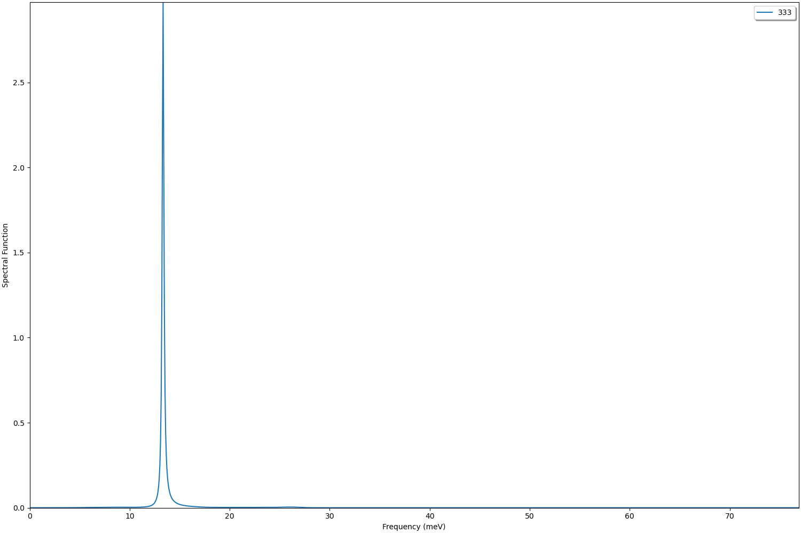
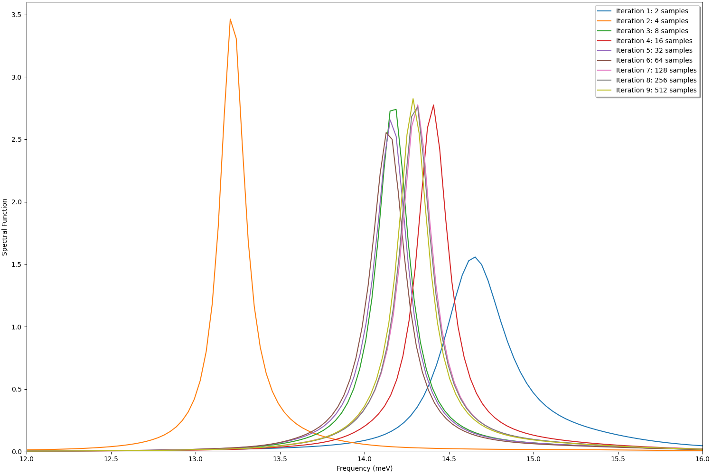
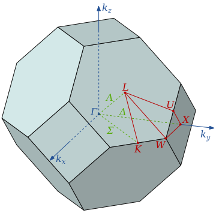
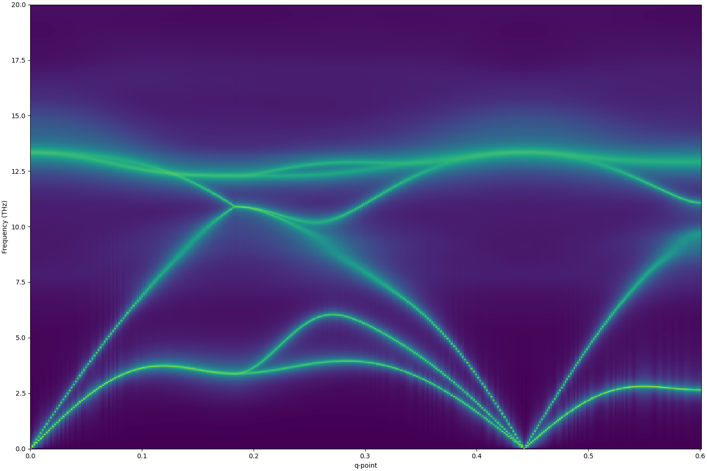
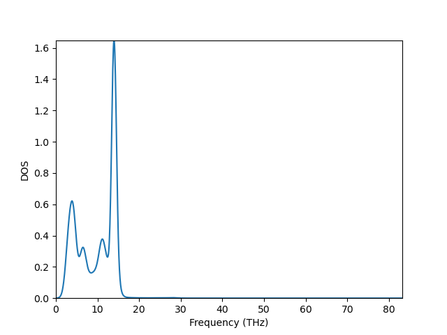
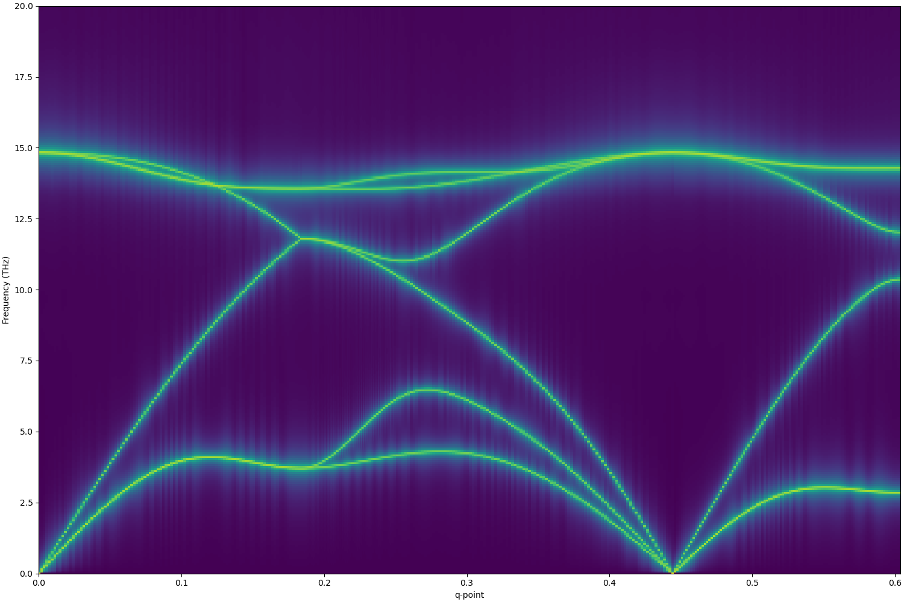
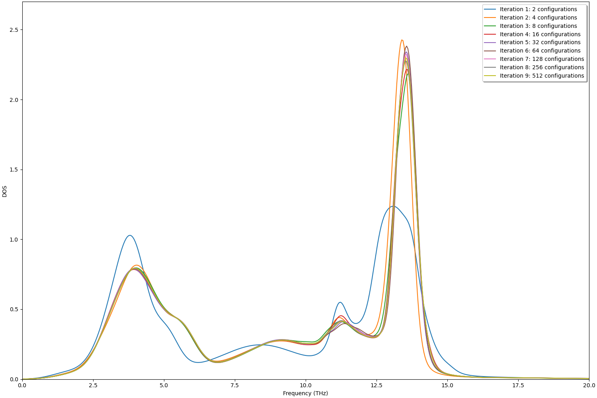
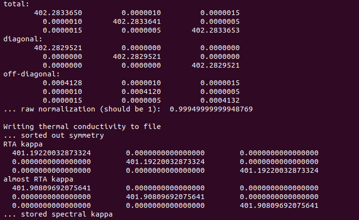
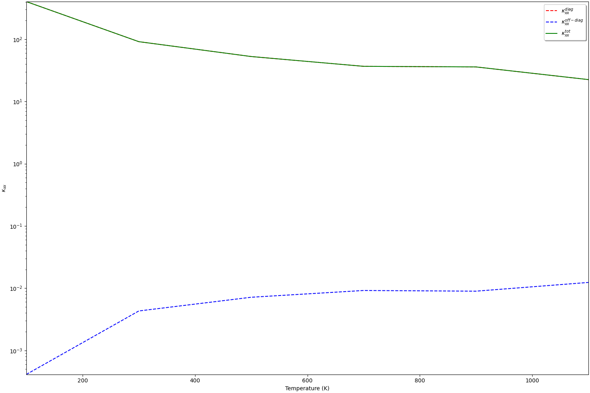
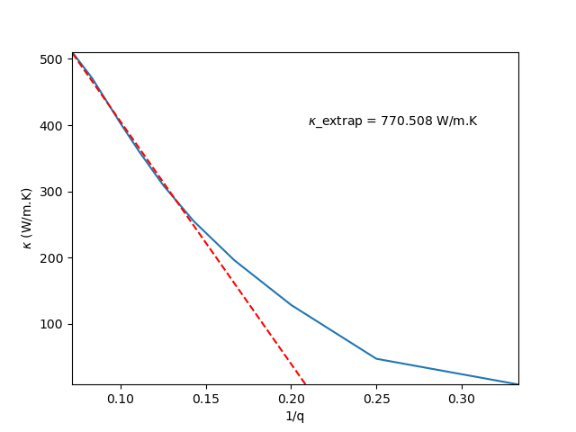

#General Scope

This tutorial covers the lineshape calculation part of the code. The goal will be to go beyond simple perturbation theory and understanding what changes in the phonon spectral quantities when anharmonicity is taken into account. We'll start by generalizing the phonon lineshape beyond the weakly interacting approximation, and then go into the calculation of the thermal conductivity from a spectral function approach.

This tutorial **does not cover**:
* Structure relaxation
* Supercell convergence
* Extracting forceconstants
* Sampling

# Preparation 

Before starting with the tutorial, make sure that you:

- Have a system for which you can generate the required data for a wide enough set of temperatures (choose somewhere between 100K and 1300K, as long as it includes one temperature on the lower end and another on the higher end). If you cannot generate this data, an example is provided for Silicon between 100K and 1100K from classical Molecular Dynamics simulations.
- Can parse files in hdf5 format (h5py for example, if you're using Python) and you have access to a plotting tool (matplotlib for example, if you're using Python).
- Read the introduction texts (and go through the recommended material) beforehand.


# Steps

The lineshape executable is composed by 4 different calculation modes, of which we'll explore 3: --highsymmetrypoint, for which the phonon spectral function is calculated for a single high-symmetry point of the crystal; --path, for which this is done now for a path in reciprocal-space along the first Brillouin zone of the crystal; and --grid, in which an equally spaced FFT grid is generated for the full Brillouin zone which allows us to get integrated quantities like the system's spectral thermal conductivity. The first two will be covered in the lineshape tutorial, while the --grid mode will be covered in the spectral thermal conductivity tutorial.

# Lineshape Introduction

In the perturbation theory approach, phonons are well defined quasiparticles, with their frequencies being only slightly shifted and broadened due to their interactions, keeping a Lorentzian representation by construction. In that case, the phonon self-energy is given by

$$\Sigma_{\lambda} = \Delta_{\lambda} ~+~ i\Gamma_{\lambda},$$

where $\lambda = (\textbf{q}, s_q)$ denotes phonon momentum and mode (in a compact notation), $\Delta$ is a constant frequency shift and $\Gamma$ is a broadening factor evaluated using the Fermi golden rule for a specific level of interaction. If we consider 3-phonon interactions, for example, it is given by

$$\Gamma_{\lambda} = \frac{\hbar \pi}{16} \sum_{\lambda' \lambda''} \left| \Phi_{\lambda \lambda' \lambda''} \right| \left[ \left( n_{\lambda'} + n_{\lambda''} + 1 \right) \delta \left( \omega_{\lambda} - \omega_{\lambda'} - \omega_{\lambda''} \right) + 2 \left( n_{\lambda'} - n_{\lambda''} \right)  \delta \left( \omega_{\lambda} - \omega_{\lambda'} + \omega_{\lambda''} \right) \right] $$

i.e. it's evaluated at the harmonic phonon frequencies, with the 3-phonon matrix elements

<p>$$\Phi_{\lambda, \lambda', \lambda''} = \sum_{ijk} \sum_{\alpha \beta \gamma} \frac{\epsilon^{i \alpha}_{\lambda} \epsilon^{j \beta}_{\lambda'} \epsilon^{k \gamma}_{\lambda''}}{\sqrt{m_i m_j m_k} \sqrt{\omega_{\lambda} \omega_{\lambda'} \omega_{\lambda''}}} \Phi^{\alpha \beta \gamma}_{ijk} \exp(i \textbf{q}\cdot\textbf{r}_i +  \textbf{q'}\cdot\textbf{r}_j + i \textbf{q''}\cdot\textbf{r}_k )$$<p>

dictating the strength of the interaction. We therefore only need the second and third order interatomic force constants to calculate it. 

In general, however, this is not the case: the self energy (and, consequently, the related quantities) is frequency dependent and is written as

$$\Sigma_{\lambda}(\Omega) = \Delta_{\lambda}(\Omega) ~+~ i\Gamma_{\lambda}(\Omega)$$

where $\Delta_{\lambda}(\Omega)$ and $\Gamma_{\lambda}(\Omega)$ are the now the frequency dependent real and imaginary part (phonon shift and lineshape) of the phonon self-energy.

This generalization is necessary since for cases with strong interactions (large anharmonic effects) phonons can substantially deviate from the harmonic picture and are no longer a well defined quasiparticle. An example of this is the fact that in inelastic neutron scattering experiments this deviation from the Lorentzian behaviour is sometimes observed (see [1] for an example on PbTe). In that case, the one-phonon neutron cross section $\sigma_{\lambda}$ takes on a more general form, and we no longer talk about a linewidth (since the phonon distribution is no longer a single peaked and broadened one) but instead of a lineshape. 

To see what's happening (make sure to check [2] and [3] for the details), we start by noting that $\sigma_{\lambda}$ is written in general as 

$$\sigma_{\lambda} \propto \int dt ~ e^{i \omega t} \langle u(t) u(0) \rangle$$

i.e., it's proportional to the Fourier transform of the time autocorrelation of the displacements of the system. This integral is simply the Fourier transformed version of the phonon's Green's function $G(\Omega)$, and after working it out we can therefore write $\sigma_{\lambda}$ as

$$\sigma_{\lambda} \propto \frac{2 \omega_{\lambda} \Gamma_{\lambda}(\Omega)}{\left[ \Omega^2 - \omega^2_{\lambda} - 2 \omega_{\lambda} \Delta_{\lambda}(\Omega) \right]^2 + 4 \omega^2_{\lambda} \Gamma^2_{\lambda}(\Omega)}$$

where $\hbar\Omega$ is the energy of the probing neutron. In short, it represents the probability of exciting a phonon with energy $\hbar\Omega$ and momentum $\textbf{q}$ in band s given a perturbing neutron of same energy and momentum. By probing through an energy range, what we obtain can be seen as the one-phonon spectral function $J(\Omega)$, a distribution that is peaked at certain frequencies that correspond to the phonon frequencies. In fact, since the Fourier tranformed phonon Green's function can be directly related to $J(\Omega)$ via the fluctuation-dissipation theorem

$$J(\Omega) = \frac{\Omega}{2 k_B T} G(\Omega)$$

the calculation of the phonon spectral function leads us directly to the one-phonon neutron scattering cross-section from inelastic neutron scattering experiments.

In the case of non-interacting phonons this distribution reduces to a Dirac delta function and is therefore unbroadened (the phonons have infinite lifetime and once excited keep propagating forever), while for cases with weak interactions it reduces to the Lorentzian distribution as one would expect. In general, however, this distribution can have multiple satellite peaks besides the main phonon frequency one, and it is in those cases that the phonon picture is broken - the phonon is no longer a well defined quasiparticle, despite us being able to still write all wanted quantities in terms of phonons. Calculating this cross-section can therefore be used as a means to check for strong anharmonic effects by observing how much it deviates from a Lorentzian distribution.

In the case where anharmonicity is induced by 3-phonon interactions, the imaginary part of the self-energy is now given in the scattering approximation by

$$\Gamma_{\lambda}(\Omega) = \frac{\hbar \pi}{16} \sum_{\lambda' \lambda''} \left| \Phi_{\lambda \lambda' \lambda''} \right|^2 \lbrace \left( n_{\lambda'} + n_{\lambda''} + 1 \right)\delta\left( \Omega - \omega_{\lambda'} - \omega_{\lambda''} \right) + \left( n_{\lambda'} - n_{\lambda''} \right) \left[ \delta\left( \Omega - \omega_{\lambda'} + \omega_{\lambda''} \right) - \delta\left( \Omega + \omega_{\lambda'} - \omega_{\lambda''} \right)\right] \rbrace ~, $$

i.e. it's now a frequency dependent quantity. For more details on this approach and on how it relates to phonon's Green's function theory, see e.g. [2].

The real part of the self-energy can then be easily calculated via Kramers-Kronig transforming the imaginary part:

$$\Delta_{\lambda}(\Omega) = \frac{1}{\pi} \int \frac{\Gamma_{\lambda}(\omega)}{\omega - \Omega} d\omega~.$$

With these two quantities in hand we can therefore build the phonon spectral function $J(\Omega)$. The phonon density of states (DOS) can be then obtained from $J(\Omega)$ by integrating over the full Brillouin zone:

$$g(\Omega) = \frac{(2\pi)^3}{V} \int_{BZ} J(\Omega)~.$$

With this, we are now ready to go through the --highsymmetrypoint and --path tutorials!

## Highsymmetrypoint

-  One of the most common uses for the --highsymmetry point calculation mode are Raman applications, where the lineshape at the Gamma point of the crystal is the only one necessary. In order to calculate it, we run the command

```
mpirun /path/to/TDEP/bin/lineshape --highsymmetrypoint GM -qg 3 3 3 --temperature 100 >hsp.log
```

Here the temperature can be replaced by the one from your sampling and the proper path to the TDEP binaries needs to be added. The flag -qg (standing for --qpoint_grid) defines the density of the q-point mesh for Brillouin zone integrations, and is a parameter that needs to be converged, together with the number of samples and cutoffs for the forceconstants just like in other tutorials. For now we can just use some reasonable value for the cutoffs (in case you're using Silicon like in the examples, an -rc2 of 6.5 and -rc3 of 3 should work fine) and number of configurations (you can use, for example, 32 configurations for now) and start by examining what we got from this calculation.

-  After running, a file named `outfile.phonon_self_energy.hdf5` will be created. This file contains all the information pertaining not only to the real and imaginary parts of the self-energy, but also contains the computed values for the spectral function for each phonon mode. In order to access this, we have to be able to read hdf5 format files. A snippet for Python with hdf5 is provided below:
```
import h5py as h5
import numpy as np
import matplotlib.pyplot as plt


# Open the file
f = h5.File("outfile.phonon_self_energy.hdf5", "r")

# Select the relevant group
anharmonic = f.get("anharmonic")

# Get the frequency axis and the intensity of the spectral function per mode per frequency
frequency = np.array(anharmonic.get("frequency"))
spectralfunction_per_mode = np.array(anharmonic.get("spectralfunction_per_mode"))
```

-  We now have access to the spectral function for each of the phonon modes and the frequency grid. Before proceeding to the plotting, we can first inspect these objects. Start by looking at the first 3 arrays inside spectralfunction_per_mode. What do you see? Is this a general feature? Why? What would happen if instead we ran the calculation at the X point? (Try it out!)

- Now that we saw how to access the spectral function, we can start to learn how to converge this object with respect to the number of configurations in our sampling and the q-point grid. To do it, we can start by plotting our spectral function from the previous example. This can be done very simply using the following (continuing from the previous snippet):

```
# Set the limits of the plot to the limits of the data. Can be changed to values closer to the peak in case we want to see the spectra function in more detail
plt.axis([frequency.min(), frequency.max(), spectralfunction_per_mode[3].min(), spectralfunction_per_mode[3].max()])

plt.plot(frequency, spectralfunction_per_mode[3])

plt.show()
```

This should result in a plot like this one:

<p align="center">
  
</p>

Here we choose to just plot one of the optical modes but in general you must be careful to check how all modes will evolve!

- Once we have seen how to do this, we can now proceed to converge the necessary values, in this case forceconstant cutoffs, number of configurations in the sampling and q-point grid. By re-running the same tdep binary as above, changing only first the number of configurations in the sampling and the q-point grid (we choose -qg 10 10 10 just to make sure the convergence isn't affected by having a sparse q-point grid like the first one, this doesn't mean -qg is converged yet!) we can inspect how the spectral function at the Gamma point evolves with this parameter. You will notice that after some threshold it will stop changing significantly, and that's when we can consider it as converged.

<p align="center">
  
</p>

In this figure we can see that by iteration 7 (128 samples) the spectral function is converged, and this is the number of configurations one should use from now on!

- Now that we converged the number of configurations , we can now proceed and converge the q-point grid. To do this, re-run the same binary as above (with the now converged sampling) and change the 3 numbers in front of the -qg flag (i.e. to 5 5 5, 7 7 7, etc.). Note that you should change the name of the output files you want to save in order for them not to be re-written! 

- After doing this for a couple of different sets of q-point grids, we can now re-do the same plot as the first one but now plotting all of the spectral functions at the same time.  It is the q-point grid at which the spectral function is converged that you should use for your calculations at this temperature. An example of this spectral function changing with the q-point grid can be seen below:

<p align="center">
  
</p>

Here the spectral functions' centers are displaced from each other merely for increased visibility purposes, and we see that the 12x12x12 grid is converged.

- You can now re-do this procedure for the forceconstant cutoffs and for a much higher temperature. What do you notice as temperature increases? Is the phonon picture preserved in all cases? Do you expect this to be the same for all systems?

## Path

-  The --path calculation mode allows us to focus on specific parts of the Brillouin zone (usually the 1st Brillouin zone). It is the calculation mode that we run when we want to add the effects of the lineshape into our phonon dispersion relations, and in this way show visually how the bands broaden and potentially mix. It also is the one that allows us to compare phonon dispersions that we obtain in our simulations to inelastic neutron scattering experiments.

-  To run this calculation mode, we do

```
mpirun /path/to/tdep/bin/lineshape --path -qg 3 3 3 --temperature 100 >path.log 
```

where again start with our lowest temperature, add our path to the TDEP binaries and start with a smaller q-point grid that we will later converge. 

- This mode allows us to define a specific path along the Brillouin zone, with the default being the same one as in the phonon dispersion relations (along the high symmetry points of the crystal). 

<p align="center">
  
</p>


- A different path can be specified using the flag --readpath, which will make TDEP read the q-point path from an infile.qpoints_dispersion file. The number of q-points between each high-symmetry point can be tuned via the flag -nq (--nq_on_path, default is 100) for a denser grid. An example file would be

```
FCC                         ! Bravais lattice type
  100                       ! Number of points on each path
    4                       ! Number paths between special points
GM  X                       ! Starting and ending special point
X   U                       !
K   GM                      !
GM  L                       !
```

or, if you want more customization,

```
CUSTOM                      !
  100                       ! Number of points on each path
    4                       ! Number paths between special points
0.000 0.000 0.000   0.000 0.500 0.500 GM X
0.000 0.500 0.500   0.000 0.625 0.375 X  U
0.375 0.750 0.375   0.000 0.000 0.000 K  GM
0.000 0.000 0.000   0.000 0.500 0.000 GM L
```

- After the calculation finishes two new files will be created: a lighter one named `outfile.dispersion_relations.hdf5` and a heavier one named `outfile.phonon_spectral_function.hdf5`. For this tutorial we'll be interested in the latter, but make sure to also explore the first. Again, we'll need a way to read hdf5 format files, for which a similar snippet as before works:

```
import h5py as h5
import numpy as np
import matplotlib.pyplot as plt
from matplotlib.colors import LogNorm

# Open the file
f = h5.File("outfile.phonon_spectral_function.hdf5", "r")

# Get the axes 
x = np.array(f.get("q_values"))
y = np.array(f.get("energy_values"))

# Get the intensities
gz = np.array(f.get("spectral_function"))
```

- We now have the frequency dependent phonon spectral function for the first Brillouin zone! This can be now used to plot the phonon dispersion relations with the effects of the lineshape for our chosen temperature displayed. In order to do so, we can resort to the following snippet (continuing from the one above):

```
# Add a little bit so that the logscale does not go nuts
gz=gz+1E-2

# For plotting, turn the axes into 2d arrays
gx, gy = np.meshgrid(x,y)

plt.pcolormesh(gx, gy, gz, norm=LogNorm(vmin=gz.min(), vmax=gz.max()), cmap='viridis')

# Set the limits of the plot to the limits of the data. This can be changed to more sensible values in case some very small values of the spectral function exist for very high energies
plt.axis([x.min(), x.max(), y.min(), y.max()])

plt.show()
```

This will result in a plot like the following:

<p align="center">
  
</p>

- We can now proceed by repeating the calculation for an increasing q-point grid as before (as well as converge the forceconstant cutoffs and number of samples), and checking for its convergence by plotting the band structure for the different values. This is, unfortunately, a bit more complicated to check than in the --highsymmetrypoint case, but can be done by comparing the plots evolution with -qg (or the other parameters) and simply seeing when it stops changing. Again, the converged value of -qg (-rc2, -rc3 and number of configurations) is the one we will be using for this temperature from now on. Note again, that in order to save the files we want to keep from being re-written we have to rename them before re-running the calculations.

- Once convergence is achieved for this temperature, we can now repeat this procedure for a much higher temperature (convergence included!). What do you see changing? Why? What can we conclude about the anharmonicity of this material? In case you used the classical Molecular Dynamics sampling, do you expect quantum effects to change anything? (Hint: see [6])

# Spectral Thermal Conductivity Introduction

To obtain the thermal conductivity outside of a well-defined phonon picture, we start by considering the Green-Kubo formula for linear response:

<p>$$\kappa_{\alpha \beta} = \frac{V}{k_B T^2} \int^{\infty}_0 \langle S_{\alpha}(t)S_{\beta}(0)\rangle dt$$<p>

where V is the system's volume (in the formal sense we take the limit to infinite volume, in practice it's the converged supercell volume), $k_B$ is Boltzmann's constant, T is the temperature and S is the heat current, representing the energy flux through the system due to the phonons. This represents a fluctuation-dissipation relationship, where the system's macroscopic ability to carry heat is determined by the fluctuations of the heat current at a microscopic level.

The first thing to consider is the meaning behind the thermal average $\langle ... \rangle$, the key quantity to calculate $\kappa_{\alpha \beta}$. As this thermal average depends on which ensemble is being considered, it is very tightly related to which kind of simulations are being performed in order to calculate it. If we can, for example, perform simulations in a way where the ensemble is the full quantum one (e.g. using PI-MD), then $\langle ... \rangle$ is a Kubo correlation-function and has encoded in it the full quantum behaviour of the fluctuations. If, on the other hand, our simulations realize a classical ensemble (e.g., using classical MD), then $\langle ... \rangle$ represents a classical correlation function and the quantum behaviour of the fluctuations is not accessible. For more information on this topic, see e.g. [2].

A half-way compromise between the two is also possible to obtain, by performing classical level simulations but considering quantum phonon occupations (Bose-Einstein instead of Boltzmann distribution). In that case, $\langle ... \rangle$ represents what is usually called a greater Green's function, defined as 

<p>$$G^{>}(X,Y) = -i \langle X(t) Y^{\dagger}(0) \rangle$$<p>

where X and Y are two operators in the Heisenberg representation and the dagger represents hermitian conjugation. In this representation of the heat current autocorrelation, some of the quantum character of the fluctuations can be recovered via the occupations despite the usage of classical simulations.

In order to evaluate $\kappa$, we start by writing the expression for the heat current in terms of phonon operators [4] :

<p>$$\textbf{S}(t) = \frac{1}{2V} \sum_{\textbf{q} s_1 s_2} \omega_{\textbf{q} s_1} \textbf{v}_{\textbf{q} s_1 s_2} B_{\textbf{q} s_1}(t) A_{\bar{\textbf{q}} s_2}(t)$$<p>

Here $\bf{v}$ are the off-diagonal phonon group velocities and couple phonons with the same momentum in different bands, while B and A are the momentum and displacement operators in the phonon representation (see [5] for the definition of these operators in terms of phonon creation and annihilation operators).

Substituting S(t) into the Green-Kubo equation we obtain

<p>$$\kappa = \frac{1}{4k_BT^2V} \sum_{\textbf{q} s_1 s_2} \sum_{\textbf{q'} s_3 s_4} \omega_{\textbf{q} s_1} \omega_{\textbf{q'} s_2} \textbf{v}_{\textbf{q} s_1 s_2} \otimes \textbf{v}_{\textbf{q'} s_3 s_4} \int^{\infty}_0 \langle B_{\textbf{q} s_1}(t) A_{\bar{\textbf{q}} s_2}(t) B_{\textbf{q'} s_3} A_{\bar{\textbf{q}'} s_4} \rangle ~dt$$<p>

where the phonon displacement and momentum operators without time argument are at t=0. 

Just as in the Peierls-Boltzmann formulation of thermal conductivity, the phonon frequencies and group velocities are directly related to the second-order force constants, and can therefore be calculated immediately once these have been determined. The thermal conductivity problem is then reduced to the evaluation of the correlation function $\langle ... \rangle$.

The correlation function shown above corresponds to a 2-phonon correlation function. In order to make its calculation manageable, we use the thermal average's version of the famous Wick's theorem, which tells us that if our anharmonicity/phonon-interaction is weak (more strictly, if the ensemble is Gaussian or very close to it) we can decouple the correlation function as 

<p>$$
\begin{aligned}
\langle B_{\textbf{q} s_1}(t) A_{\bar{\textbf{q}} s_2}(t) B_{\textbf{q'} s_3} A_{\bar{\textbf{{q}}}' s_4} \rangle &\simeq \langle B_{\textbf{q} s_1}(t) B_{\textbf{q'} s_3} \rangle \langle A_{\bar{\textbf{q}} s_2}(t) A_{\bar{\textbf{q}}' s_4} \rangle \delta \left( \textbf{q} ~+~ \textbf{q'} \right) \\
& + \langle B_{\textbf{q} s_1}(t) A_{\bar{\textbf{q}}' s_4} \rangle \langle A_{\bar{\textbf{q}} s_2}(t) B_{\textbf{q'} s_3} \rangle \delta \left( \textbf{q} ~-~ \textbf{q'} \right)
\end{aligned}
$$<p>
	
This decoupling scheme lends itself very obviously to be used when stochastic sampling is performed, since in that case the ensemble is Gaussian by definition, though it will not necessarily mean the results will be closer to experiment if that approximation is not viable for the selected system.

If we now convert our correlation functions into spectral functions via the relation

<p>$$\langle X(t) Y \rangle = i G^>(X,Y^{\dagger}) = \int J^{X Y^{\dagger}}(\Omega)~(n(\Omega)+1)e^{i\omega t} d\Omega$$<p>
	
where $J(\Omega)$ represents the spectral function of that correlation function, and use the convolution theorem to turn the product of correlation functions in the time domain into a convolution involving spectral functions in the frequency domain (see [5] for more on this applied to Raman scattering), we can obtain (after some math and doing $s_1=s_4$ and $s_2=s_3$)

<p>$$\kappa^{\alpha \beta} = \frac{\pi}{2V} \sum_{\textbf{q}} \sum_{s_1 s_2} \mathfrak{Re}(\textbf{v}^{\alpha}_{\textbf{q} s_1 s_2} \textbf{v}^{\beta}_{\textbf{q} s_1 s_2}) \int^{+\infty}_{-\infty} J^{A A^{\dagger}}_{\textbf{q}s_1 s_1} (\Omega) ~ J^{A A^{\dagger}}_{\textbf{q} s_2 s_2} (\Omega) ~ c_v(\Omega) ~ d\Omega$$<p>
	
with $c_v(\Omega)$ the system's heat capacity in its frequency dependent form, defined as 

<p>$$c_v(\Omega) = \frac{\Omega^2}{k_B T^2} n(\Omega) (n(\Omega)+1)$$<p>

This corresponds to equation (6) in [7] and it is what TDEP returns when it calculates the spectral thermal conductivity, as well as the spectrally and mode decomposed $\kappa^{\alpha \beta}_{s_1 s_2}(\Omega)$ where the integral over the frequency and sum over modes aren't performed but the sum over q is. With this result, are now able to calculate the spectral thermal conductivity of our system as long as we are able to perform the frequency integral above.


## Grid

- The --grid calculation mode is the one we run when we want to obtain integrated spectral quantities. In this mode, an equally spaced FFT grid is generated for the full Brillouin zone, and for each of these points the spectral function is calculated. Afterwards, integrated quantities like the phonon DOS or the thermal conductivity are automatically calculated.

- In order to run this calculation mode, we do

```
mpirun /path/to/tdep/bin/lineshape --grid -qg 3 3 3 --temperature 100 >grid.log
```

where again we choose the temperature corresponding to our sampling.

- After our calculation finishes, three new files are created:  `outfile.grid_spectral_function.hdf5`, where the spectral function per q-point, per-mode per-frequency is stored, `outfile.thermal_conductivity.hdf5` and `outfile.phonon_spectralfunction_dos.hdf5`. For the purposes of this tutorial we'll be focusing on the last two files, but make sure to check the first one as well.

- We'll start by looking at the `outfile.phonon_spectralfunction_dos.hdf5` file. This file contains the information regarding the phonon DOS in some different ways (full DOS, DOS per mode, DOS per site, etc.), which can very easily be plotted. To do this, we'll again need a way to read hdf5 files which we'll do as before:

```
import h5py as h5
import numpy as np
import matplotlib.pyplot as plt

# Open the file
f = h5.File("outfile.phonon_spectralfunction_dos.hdf5", "r")

# Get the frequency axis
frequencies = np.array(f.get("frequencies"))

# Get the phonon DOS intensities
dos = np.array(f.get("dos"))

# Set the limits of the plot to the limits of the data
plt.axis([frequencies.min(), frequencies.max(), dos.min(), dos.max()])

plt.plot(frequencies, dos)

plt.show()
```

This will produce a plot like the following:

<p align="center">
  
</p>

If we look at the corresponding (same sampling, same q-point grid) anharmonic band structure, what connection do you see between the two?

<p align="center">
  
</p>

- Just like for other quantities, there are parameters that need to be converged before continuing (forceconstant cutoffs, number of configurations in the sampling and q-point grid). The procedure is the same as before, and you should therefore make sure that the density of states is converged relative to all of them before proceeding. For the sampling, for example, you'll obtain something like this

<p align="center">
  
</p>

where we can see that by iteration 5 (32 configurations) we are converged.

  
- Next, we will look at the `outfile.thermal_conductivity.hdf5` file. This file contains not only the spectral thermal conductivity per mode per direction of the tensor, but also information pertaining to the thermal conductivity in the RTA approximation (see https://tdep-developers.github.io/tdep/program/thermal_conductivity for a brief explanation on this approximation in case you're not familiar with it) like the lifetimes, mean free path, etc. For the purposes of this tutorial we'll be focusing in the spectral thermal conductivity only, but make sure you explore the rest of the file as well.

- We'll start this section by looking at the output of the command we executed earlier, which should be stored in the `grid.log` file. Besides the timings and spectral function calculation, you should obtain something like this:

<p align="center">
  
</p>

In this file, we see that after calculating the spectral function for each point of the q-point grid, TDEP calculates and prints the results for the total thermal conductivity calculated with the Green-Kubo formalism, as well as its separation into the diagonal and off-diagonal mode contributions (last equation for $\kappa$ in the introduction, with $s_1 = s_2$ and $s_1 \neq s_2$ respectively). This decomposition allows us to see if the thermal conductivity of the system we're studying is influenced heavily by the phonon coherences (mode-mixing contributions) or if it's well described by the phonon populations (the mode-diagonal contributions), as well as study how this scenario evolves with temperature. In the case of Silicon, one finds that the mode-mixing contributions are residual when compared to the mode-diagonal ones, and that although their importance increases with temperature they never really become relevant. If we plot, for example, the different contributions to $\kappa_{xx}$ against the temperature, we find a plot like the one below:

<p align="center">
  
</p>

In this figure, we see that even when plotting the different contributions in logarithmic scale, the mode-diagonal contributions are virtually indistinguishable from the total thermal conductivity. This is, however, not the case for some systems, for which these mode-mixing contributions can become even the major contributor to the system's total thermal conductivity (see [8])

Afterwards, the raw normalization of the phonon DOS is returned, where since it should integrate to 1 the closer it is to this number the more converged the calculation is. Finally, the thermal conductivity calculated within the RTA approximation is returned, as well as in an "almost RTA" approximation where the only change is that the phonon lifetimes are instead taken to be the convolution of the spectral functions. Since in RTA there is no mode-mixing involved and phonons are taken to be well defined quasiparticles, the comparison between it and the Green-Kubo result works as a measure of how much importance these processes hold for the thermal conductivity calculation and how much is the quasiparticle picture broken.

- Contrary to the other convergence cases, as the thermal conductivity is an integrated quantity it should be calculated in the limit of an infinitely dense q-point grid. For an increasingly denser grid the thermal conductivity should start evolving linearly with 1/q as 1/q $\rightarrow 0$. To converge this value one has to calculate the thermal conductivity for increasing q, plot it as $\kappa$ vs 1/q and fit the points after which the behavior becomes linear to a linear function (see [9]). It is then the y-intersect of the fit that corresponds to the thermal conductivity in the infinitely-dense q-point grid limit. This plot should look something like this:

<p align="center">
  
</p>

- After having converged our integrated thermal conductivity we can now finally look at what our frequency dependent thermal conductivity looks like. To do this, we can use the following snippet (note that to have some peak resolution in this plot you'll have to run --grid with a denser q-point grid than the one in the example above):

```
import numpy as np
import h5py as h5
import matplotlib.pyplot as plt

# Open the file
f = h5.File("outfile.thermal_conductivity.hdf5", "r")

# Get the frequency axis
frequencies = np.array(f.get("energy_axis"))

# Get the spectral thermal conductivity per mode per tensor element
spectral_mode_kappa_tensor = np.array(f.get("spectral_kappa"))

# Isolate the xx component of the tensor, for example
spectral_mode_kappa_xx = spectral_mode_kappa_tensor[:,:,0,0,:]

spectral_kappa_x = []

# Sum the mode contributions for each frequency point
for i in range(len(frequencies)):
	spectral_kappa_x.append(sum(spectral_mode_kappa_xx[:,:,i].flatten()))

plt.plot(frequencies, spectral_kappa_x)

plt.show()

```

This should result in a plot like the following:

<p align="center">
  
</p>


In this plot we see that all of the heat is carried by the lower frequency acoustic modes and none by the optical ones. Why is that the case? Should this be the case in general? What is the influence of temperature here?

- You should now re-do this process for a higher temperature. How do you see the DOS evolving? What happens to the total and spectral thermal conductivity?


# References

[1](https://journals.aps.org/prl/abstract/10.1103/PhysRevLett.112.175501) Li, C.W. et. al., Physical review letters 112 (17), 175501 (2014)

[2](https://doi.org/10.48550/arXiv.2303.10621) A. Castellano et. al., arXiv:2303.10621 (2023)

[3](https://journals.aps.org/pr/abstract/10.1103/PhysRev.128.2589) A.A. Maradudin et. al., Phys. Rev. 128, 2589 (1962)

[4](https://doi.org/10.1038/s41467-019-11572-4) L. Isaeva et. al. Nature Communications, 10(1):3853, (2019)

[5](https://journals.aps.org/prmaterials/abstract/10.1103/PhysRevMaterials.6.033607) N. Benshalom, et. al. , Phys Rev Mater 6, 033607 (2022) 

[6](https://www.pnas.org/doi/full/10.1073/pnas.1707745115) Kim, D., et. al.,  Proceedings of the National Academy of Sciences of the United States of America, _115_(9), 1992–1997 (2018)

[7](https://www.nature.com/articles/s41524-021-00523-7) Dangic, D. et. al., npj Computational Materials volume 7:57 (2021) 

[8](https://www.nature.com/articles/s41567-019-0520-x) Simoncelli, M. et. al., Nature Physics volume 15, pages 809–813 (2019)

[9](https://journals.aps.org/prb/abstract/10.1103/PhysRevB.84.085204) Esfarjani, K. et. al., Phys. Rev. B 84, 085204 (2011)
