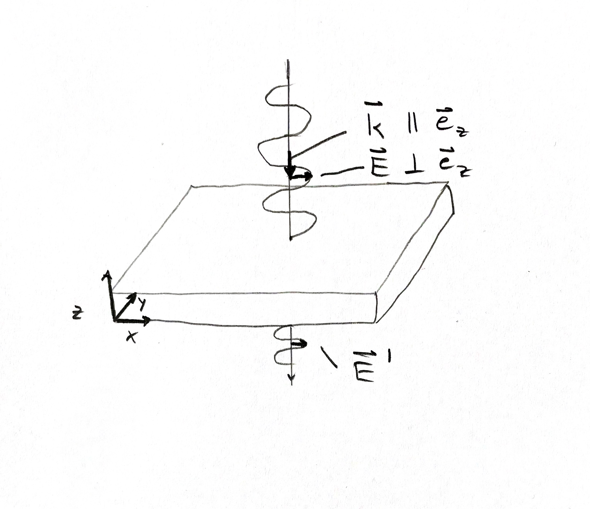

Infrared spectra with TDEP
===

This tutorial covers the basics to compute first-order Infrared spectra with TDEP. We will cover the case of 3ph scattering in magnesium oxide similar to Ref. [[Fugallo2018]](#Suggested-reading), and connect it to the TDEP response formalism described in [[Benshalom2022]](#Suggested-reading).

## Preparation

- Have a converged set of 2nd and 3rd order force constants.

- Have a DFT code ready that can compute the dielectric tensor $\varepsilon$ and Born effective charge tensors $Z_i$ for you.

- **We need the most recent version of ASE in order to be able to parse dielectric tensors and Born effective charges**. Please make sure you have that installed, e.g., by running

  ```
  pip install git+https://gitlab.com/ase/ase.git@master
  ```

  The parsers will work for VASP, Quantum Espresso, and FHI-aims (the latter only computes the dielectric tensor). For Quantum Espresso, please note the extra step explained in the `00_preparation/qe_dielectric_tensors` tutorial.

## Background

Infrared absorption describes the phenomenon of a polar insulator or semiconductor absorbing light at infrared wavelengths (few $\text{cm}^{-1}$ to few thousand $\mathrm{cm}^{-1}$), i.e., well below the bandgap. The simplest explanation is that the incident light drives certain phonon modes which couple to electromagnetic radiation (optical modes) and therefore loses energy. The energy loss can be measured as a function of wavelength or frequency, and from the resulting spectrum we can learn which phonons were excited.

A sketch of the scattering geometry copied from [Ref. 1](#Suggested-reading) is shown below. Note that the incident angle is typically (very close to) perpendicular to the sample surface and the angle is exaggerated for visualization.

**TODO: Update Figure and use notation from Fugallo2018**

<p>
	
  <figcaption><center><em>Figure from  <a href=#Suggested-reading>Ref. 1</a></em></center></figcaption>
</p>


The incoming light intensity is denoted as $I_0$ , and an amount $I_0 R$ is reflected upon incidence on the surface, where $R$ is the _reflectivity_, so that the remaining light has an intensity $I_1 = I_0 (1-R)$ within the sample. While passing through the sample, an amount $I_1 \Omega$ is absorbed, hence $\Omega$ denotes the _absorptivity_ of the sample, and an amount $I_2 = I_1 (1-\Omega) = I_0 (1-R)(1-\Omega)$ remains. When leaving the sample, an amount $I_2 R$ is reflected, leaving and amount $I_\text{measure} = I_2 (1-R)= I_0 (1-R)^2(1-\Omega)$ for measurement.

The reflectivity $R$ and absorptivity $\Omega$ are intimately related to the _complex refraction index_ $\tilde n (\omega)$, or likewise the _complex dielectric function_ $\epsilon (\omega)$ of the material, and depend on the frequency (or wavelength) of the incident light. It will be our task to determine these functions from which the optical properties can be determined, as further detailed below.

Note that the intensity of the transmitted as well as the reflected beam will depend on both $R$ and $\Omega$, a full description of the scattering experiment therefore needs both quantities.

### Defintions

**Reflectivity $R$:** Amount of incident light that gets reflected such that $I_\text{reflected} = R I_0$. It is related to the

**Complex _index of refraction_ $\tilde n$**:

$$
\tilde n = n + \mathrm{i} \kappa~,
$$

with real component $n$ and complex component $k$:

$$
R=\frac{\left(n-1\right)^2+\kappa^2}{\left(n+1\right)^2+\kappa^2}~.
$$

**Dielectric function $\epsilon$**: The complex index of refraction $\tilde n$ is related to the complex _dielectric function_ $\epsilon$ through

$$
\epsilon = \epsilon_1 + \mathrm{i} \epsilon_2
$$

via

$$
\begin{align}
\epsilon_1 &= n^2 - \kappa^2 \\
\epsilon_2 &= 2n\kappa
\end{align}
$$

This can be solved for $n$ and $\kappa$ to yield

$$
\begin{align}
n^2 
&= \frac{1}{2} \left[ \left( \epsilon_1^2 + \epsilon_2^2 \right)^{1/2} + \epsilon_1 \right] \\
\kappa^2 
&= \frac{1}{2} \left[ \left( \epsilon_1^2 + \epsilon_2^2 \right)^{1/2} - \epsilon_1 \right]
\end{align}
$$

This can be used to express the reflectivity $R$ in terms of the dielectric function,

$$
R 
=\left|\frac{\sqrt{\epsilon}-1}{\sqrt{\epsilon}+1}\right|^2~.
$$

**Absorptivity $\Omega$**: Amount of light that gets absorbed such that $I_\text{absorbed} = \Omega I_0$. This intensity is related to the

**absorption coefficient $A$** and depends exponentially on the _sample thickness_ $d$ (Beer–Lamber law) via

$$
\Omega 
= 1 - \mathrm{e}^{- Ad}
= 1 - \mathrm{e}^{- a}~,
$$

where $a$ is the _absorbance_ of the sample.

The absorption coefficient is directly related to the imaginary part of the dielectric function $\epsilon_2$, the (real) index of refraction $n$, and speed of light $c$ via

$$
A (\omega) = \frac{\omega \epsilon_2 (\omega)}{c n(\omega)}~,
$$

now making the frequency dependence explicit.

### Model dielectric function

As a first step, we take the damped harmonic oscillator model for the complex dielectric function,

$$
{\epsilon}(\omega)=\epsilon_{\infty}+\frac{S \omega_0^2}{\omega_0^2-\omega^2-i \omega \gamma}~,
$$

which describes the dielectric response of a damped harmonic oscillator with _oscillator strength_ $S$, _eigenfrequency_ $\omega_0$, and _damping constant_ $\gamma$.

**Bonus points: Figure out the value of $S$ in [[Fugallo2018]](#Suggested-reading).**

**_IMPORTANT NOTE:_** The oscillator function is sometimes with defined as

$$
{\epsilon}(\omega)=\epsilon_{\infty}+\frac{S}{\omega_0^2-\omega^2-i \omega \gamma}~,
\tag{1}
$$

e.g. in [[Gonze1997]](#Suggested-reading), i.e., with $S$ instead of $S \omega^2_0$ in the nominator. From a computational point of view it is a bit more natural to use this definition because then $S$ will be independent of the eigenfrequency $\omega_0$, so we are adopting this convention in the following.

### Microscopic derivation (sketch)

**We use a simplified notation to illustrate the derivation, for details see [Ref. 3](#Suggested-reading)!**

The dielectric function in optics relates the electric field $\mathbf E$ and polarization $\mathbf P$ via

$$
\mathbf P (\omega) = \epsilon (\omega) \mathbf E (\omega)~,
$$

where retardation effects are neglected. In the case of light absorption, we are interested in the induced polarization that the solid develops in response to incoming light (= electric field). In the limit of weak fields, we can leverage the fluctuation-dissipation theorem and obtain the dielectric function as the polarization-polarization response in equilibrium:

$$
\epsilon (\omega) = \int \mathrm{e}^{- \mathrm i \omega t} \left\langle P(t) P \right\rangle \mathrm d t~.
\tag{2}
$$

Expanding the polarization to first order in atomic displacements $u_i$, we get

$$
\mathbf P(t) = \sum_i Z_i \mathbf u_i(t)~,
$$

with *Born effective charge* $Z_i$. Using this in Eq. (2), we get

$$
\begin{align}
\epsilon (\omega) 
&= \sum_{ij} Z_i Z_j \int \mathrm{e}^{- \mathrm i \omega t} \left\langle u_i(t) u_j \right\rangle \mathrm d t \\
&= \sum_{qq'} Z_q Z_{q'} \int \mathrm{e}^{- \mathrm i \omega t} \left\langle u_q(t) u_{q'} \right\rangle \mathrm d t~,
\end{align}
$$

where $q$ is a mode label and $u_q = \sum_i e_{iq} u_i$ transform the real-space displacement $u_i$ to the mode displacement $u_q$. Then, by assuming that cross correlations $q, q'$ are small when $q \neq q'$ so that $\left\langle u_q(t) u_{q'} \right\rangle \approx \left\langle u_q(t) u_{q} \right\rangle \delta_{qq'}$, and introducing the _phonon Green's function_ $G_q(\omega)$ as

$$
\begin{align}
G_q (\omega) = \int \mathrm{e}^{- \mathrm i \omega t} \left\langle u_q(t) u_{q} \right\rangle \mathrm d t~,
\end{align}
$$

we can write

$$
\epsilon (\omega) = \sum_q \left\lvert Z_q \right\rvert^2 G_q (\omega)
\equiv \sum_q S_q G_q (\omega)~,
$$

and identify $S_q = \left\lvert Z_q \right\rvert^2$ as the *oscillator strength* of mode $q$. Non-diagonal mode correlations and higher-order phonon effects are neglected here.

Note that the Green's function $G_q (\omega)$ is tightly connected to the *phonon spectral functions* $J_q(\omega)$ via

$$
\begin{align}
J_q (\omega) 
	&= - \frac{1}{\pi} \mathrm{Im} \, G_q (\omega) \\
\implies
\mathrm{Im} \, G_q (\omega) 
	&= -\pi J_q (\omega)~.
\end{align}
$$

The spectral function $J_q (\omega)$ is the quantity that the `lineshape` code in TDEP computes.

We can reconstruct the full Green's function (cf. Eq. (14) in [[Benshalom2022]](#Suggested-reading)) by obtained the real part of $G_q$ via the Kramers-Kronig transformation that relates real and imaginary parts of an analytic function $\chi = \chi_1 + \mathrm i \chi_2$:

$$
\begin{align}
\chi_1(\omega)=\frac{1}{\pi} \mathcal{P} \int_{-\infty}^{\infty} \frac{\chi_2\left(\omega^{\prime}\right)}{\omega^{\prime}-\omega} d \omega^{\prime}~.
\end{align}
$$

Therefore we can construct the full Green's function from the spectral function (= imaginary part) alone.

Note that Eq. (14) in [[Benshalom2022]](#Suggested-reading)) reads

$$
G_s(Z)=\frac{2 \omega_s}{\omega_s^2-2 \omega_s \Sigma_s(Z)-Z^2}
\tag{3}~,
$$

so there is a factor $\omega_s/2$ to be considered when comparing this to Eq. (1) above or Eq. (3) in [[Fugallo2018]](#Suggested-reading).

### Anisotropy

Taking anisotropy of the medium into account, Eq. (1) generalizes to

$$
\begin{align}
{\epsilon}^{\alpha \beta}(\omega)
	& = \epsilon^{\alpha \beta}_{\infty}
		+ \sum_q \frac{S_q^{\alpha \beta}}{\omega_0^2-\omega^2-i \omega \gamma}~,
\end{align}
$$

where $S_q^{\alpha \beta}$ is given in the microscopic theory as

$$
S^{\alpha \beta}_q = \frac{4 \pi}{V} Z_q^\alpha Z_q^\beta~.
$$


### Transverse field

One more important aspect to consider is the transverse nature of light propagating as an electromagnetic wave in vacuum or air:

<p>
	
  <figcaption><center><em>Scattering geometry: (Transverse) E field propagating in z direction perpendicular to slab.</em></center></figcaption>
</p>
**Question:** Imagine the experimental setup to be as depicted above. In what direction does the polarization $\mathbf P$ need to point so that the $\mathbf E$ field can interact with it?

**Question:** Which phonon wave vectors $\{ \mathbf q \}$ are we probing in this setup?

**Question:** What is the consequence for the oscillator strength? Do all modes contribute to the dielectric function? Which do?


## Steps

- Go to the folder `example_MgO`
- Perform sTDEP sampling for MgO at 300K until you reach convergence
- Extract 2nd and 3rd order force constants
- Copy `infile.ucposcar`, `infile.lotosplitting` and the `infile.forceconstant` + `infile.forceconstant_thirdorder` into a new folder
- Run `lineshape` with `lineshape --temperature TEMPERATURE --qpoint Q1 Q2 Q3 --qdirin Q1 Q2 Q3` where you fill the numbers according to the considerations above. This will produce the phonon spectral function and write it to `outfile.phonon_self_energy.hdf5`
- Copy `infile.ucposcar`, `infile.lotosplitting`, and `outfile.phonon_self_energy.hdf5` to the `example_MgO/IR` folder
- Run `tdep_compute_ir_intensities` which will compute the oscillator strength $S_q$ for each mode
- Now put everything together! Open the Jupyter notebook `example_MgO/IR/notebook_get_ir.ipynb` and follow the steps to compute the optical functions defined in [[Fugallo2018]](#Suggested-reading)
- Compare the results to the experimental study in Ref. [[Hofmeister2003]](#Suggested-reading)


## Suggested reading

- [[0] M. T. Dove, *Introduction to Lattice Dynamics* (Cambridge University Press, 1993), Chp. 10](https://doi.org/10.1017/CBO9780511619885)
- [[1] A. M. Hofmeister, E. Keppel, and A. K. Speck, Mon. Not. R. Astron. Soc. **345**, 16 (2003)](https://academic.oup.com/mnras/article/345/1/16/984419)
- [[2] G. Fugallo, B. Rousseau, and M. Lazzeri, Phys Rev B **98**, 184307 (2018)](https://journals.aps.org/prb/abstract/10.1103/PhysRevB.98.184307)
- [[3] N. Benshalom, G. Reuveni, R. Korobko, O. Yaffe, and O. Hellman, Phys Rev Mater **6**, 033607 (2022)](https://journals.aps.org/prmaterials/abstract/10.1103/PhysRevMaterials.6.033607)
- [[4] X. Gonze and C. Lee, Phys Rev B **55**, 10355 (1997)](https://journals.aps.org/prb/abstract/10.1103/PhysRevB.55.10355)
