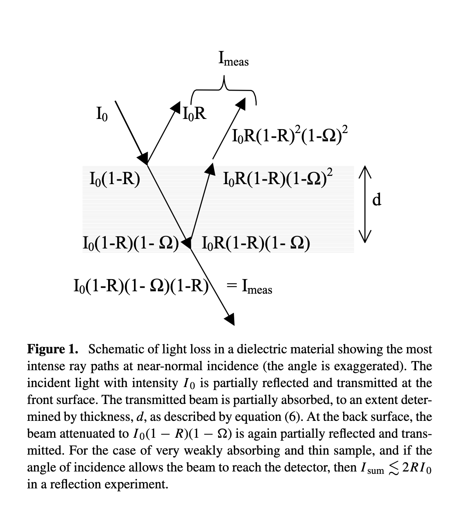

Infrared spectra with TDEP
===

This tutorial covers the basics to compute first-order Infrared spectra with TDEP. What we need to compute is the Infrared scattering cross section.

## Preparation

- Have a converged set of 2nd and 3rd order force constants.

- Have a DFT code ready that can compute the dielectric tensor $\varepsilon$ and Born effective charge tensors $Z_i$ for you.

- **We need the most recent version of ASE in order to be able to parse dielectric tensors and Born effective charges**. Please make sure you have that installed, e.g., by running

  ```
  pip install git+https://gitlab.com/ase/ase.git@master
  ```

  The parsers will work for VASP, Quantum Espresso, and FHI-aims (the latter only computes the dielectric tensor). For Quantum Espresso, please note the extra step explained in the `00_preparation/qe_dielectric_tensors` tutorial.

## Background

Infrared absorption describes the phenomenon of a polar insulator or semiconductor absorbing light at infrared wavelengths (few $\text{cm}^{-1}$ to few thousand $\mathrm{cm}^{-1}$), i.e., well below the bandgap. The simplest explanation is that the incident light drives certain phonon modes which couple to electromagnetic radiation (optical modes) and therefore loses energy. The energy loss can be measured as a function of wavelength or frequency, and from the resulting spectrum we can learn which phonons were excited.

A sketch of the scattering geometry copied from [Ref. 1](#Suggested-reading) is shown below. Note that the incident angle is typically (very close to) perpendicular to the sample surface and the angle is exaggerated for visualization.

<p>
	
  <em>Figure from  <a href=#Suggested-reading>Ref. 1</a> </em>
</p>

The incoming light intensity is denoted as $I_0$ , and an amount $I_0 R$ is reflected upon incidence on the surface, where $R$ is the _reflectivity_, so that the remaining light has an intensity $I_1 = I_0 (1-R)$ within the sample. While passing through the sample, an amount $I_1 \Omega$ is absorbed, hence $\Omega$ denotes the _absorptivity_ of the sample, and an amount $I_2 = I_1 (1-\Omega) = I_0 (1-R)(1-\Omega)$ remains. When leaving the sample, an amount $I_2 R$ is reflected, leaving and amount $I_\text{measure} = I_2 (1-R)= I_0 (1-R)^2(1-\Omega)$ for measurement.

The reflectivity $R$ and absorptivity $\Omega$ are intimately related to the _complex refraction index_ $\tilde n (\omega)$, or likewise the _complex dielectric function_ $\epsilon (\omega)$ of the material, and depend on the frequency (or wavelength) of the incident light. It will be our task to determine these functions from which the optical properties can be determined, as further detailed below.

Note that the intensity of the transmitted as well as the reflected beam will depend on both $R$ and $\Omega$, a full description of the scattering experiment therefore needs both quantities.

### Defintions

**Reflectivity $R$:** Amount of incident light that gets reflected such that $I_\text{reflected} = R I_0$. It is related to the

**Complex _index of refraction_ $\tilde n$**:

$$
\tilde n = n + \mathrm{i} \kappa~,
$$

with real component $n$ and complex component $k$:

$$
R=\frac{\left(n-1\right)^2+\kappa^2}{\left(n+1\right)^2+\kappa^2}~.
$$

**Dielectric function $\epsilon$**: The complex index of refraction $\tilde n$ is related to the complex _dielectric function_ $\epsilon$ through

$$
\epsilon = \epsilon_1 + \mathrm{i} \epsilon_2
$$

via

$$
\begin{align}
\epsilon_1 &= n^2 - \kappa^2 \\
\epsilon_2 &= 2n\kappa
\end{align}
$$

This can be solved for $n$ and $\kappa$ to yield

$$
\begin{align}
n^2 
&= \frac{1}{2} \left[ \left( \epsilon_1^2 + \epsilon_2^2 \right)^{1/2} + \epsilon_1 \right] \\
\kappa^2 
&= \frac{1}{2} \left[ \left( \epsilon_1^2 + \epsilon_2^2 \right)^{1/2} - \epsilon_1 \right]
\end{align}
$$

This can be used to express the reflectivity $R$ in terms of the dielectric function,

$$
R 
=\left|\frac{\sqrt{\epsilon}-1}{\sqrt{\epsilon}+1}\right|^2~.
$$

**Absorptivity $\Omega$**: Amount of light that gets absorbed such that $I_\text{absorbed} = \Omega I_0$. This intensity is related to the

**absorption coefficient $A$** and depends exponentially on the _sample thickness_ $d$ (Beer–Lamber law) via

$$
\Omega 
= 1 - \mathrm{e}^{- Ad}
= 1 - \mathrm{e}^{- a}~,
$$

where $a$ is the _absorbance_ of the sample.

The absorption coefficient is directly related to the imaginary part of the dielectric function $\epsilon_2$, the (real) index of refraction $n$, and speed of light $c$ via

$$
A (\omega) = \frac{\omega \epsilon_2 (\omega)}{c n(\omega)}~,
$$

now making the frequency dependence explicit.

### Model dielectric function

As a first step, we take the damped harmonic oscillator model for the complex dielectric function,

$$
{\epsilon}(\omega)=\epsilon_{\infty}+\frac{S \omega_0^2}{\omega_0^2-\omega^2-i \omega \gamma}~,
$$

which describes the dielectric response of a damped harmonic oscillator with _oscillator strength_ $S$, _eigenfrequency_ $\omega_0$, and _damping constant_ $\gamma$.

### Microscopic derivation (sketch)

**We use a simplified notation to illustrate the derivation, for details see [Ref. 3](#Suggested-reading)!**

Dielectric function as polarization-polarization response:
$$
\epsilon (\omega) = \int \mathrm{e}^{- \mathrm i \omega t} \left\langle P(t) P \right\rangle \mathrm d t
$$

Polarization to first order in atomic displacements $u_i$ with Born effective charge $Z_i$:
$$
P(t) = \sum_i Z_i u_i(t)
$$

Therefore we get

$$
\begin{align}
\epsilon (\omega) 
&= \sum_{ij} Z_i Z_j \int \mathrm{e}^{- \mathrm i \omega t} \left\langle u_i(t) u_j \right\rangle \mathrm d t \\
&= \sum_{qq'} Z_q Z_{q'} \int \mathrm{e}^{- \mathrm i \omega t} \left\langle u_q(t) u_{q'} \right\rangle \mathrm d t~,
\end{align}
$$

where $q$ is a mode label and $u_q = \sum_i e_{iq} u_i$ transform the real-space displacement $u_i$ to the mode displacement $u_q$. Then, by assuming that cross correlations $q, q'$ are small when $q \neq q'$ so that $\left\langle u_q(t) u_{q'} \right\rangle \approx \left\langle u_q(t) u_{q} \right\rangle \delta_{qq'}$, and introducing the _phonon Green's function_ $G_q(\omega)$ as

$$
\begin{align}
G_q (\omega) = \int \mathrm{e}^{- \mathrm i \omega t} \left\langle u_q(t) u_{q} \right\rangle \mathrm d t~,
\end{align}
$$

we can write

$$
\epsilon (\omega) = \sum_q \left\lvert Z_q \right\rvert^2 G_q (\omega)
\equiv \sum_q S_q G_q (\omega)~,
$$

and identify $S_q = \left\lvert Z_q \right\rvert^2$ as the *oscillator strength* of mode $q$. Non-diagonal mode correlations and higher-order phonon effects are neglected here.

### Alternative with spectral function

[…] where $q$ is a mode label and $u_q = \sum_i e_{iq} u_i$ transform the real-space displacement $u_i$ to the mode displacement $u_q$, then, by assuming that cross correlations $q, q'$ are small when $q \neq q'$ so that $\left\langle u_q(t) u_{q'} \right\rangle \approx \left\langle u_q(t) u_{q} \right\rangle \delta_{qq'}$, and introducing the _phonon spectral function_ $J_q(\omega)$ as

$$
\begin{align}
n (\omega_q, T) J_q (\omega) = \int \mathrm{e}^{- \mathrm i \omega t} \left\langle u_q(t) u_{q} \right\rangle \mathrm d t~,
\end{align}
$$

where $n (\omega_q, T)$ is the Bose weight of mode $q$ at temperature $T$, we can write

$$
\epsilon (\omega) = \sum_q \left\lvert Z_q \right\rvert^2 n (\omega_q, T) J_q (\omega)
\equiv \sum_q S_q n (\omega_q, T) J_q (\omega)~,
$$

and identify $S_q = \left\lvert Z_q \right\rvert^2$ as the *oscillator strength* of mode $q$.


## Steps

### Start: Inspect phonon dispersion and selection rules

- Create the phonon dispersion for your forceconstants

  ```
  FILL COMMAND
  ```

- Check you many Infrared active modes you have
  ```
  FILL SHELL OUTPUT
  ```

- Check the file `outfile.mode_activity.csv` which contains the mode frequencies at the Gamma point, and whether they are Raman active (1) or not (0). (Same for IR activity).

- Plot this file.

### Compute mode intensities

- Displacements for each phonon mode with the command

  ```
  FILL COMMAND
  ```

  This will create 2 displacement (+ and -) for each mode.

- Filter out modes that are not Raman active with the command

  ```
  FILL COMMAND
  ```

- Move the files to folders and compute the dielectric tensor, e.g., with Quantum Espresso.

- Parse the outputs with the command
  ```
  FILL COMMAND
  ```

- Now we can compute the mode intensities (Eq. (9) in [2]) by running
  ```
  FILL COMMAND
  ```

- This will return `outfile.mode_intensity.csv`

- Plot that file

## Infrared scattering cross section including temperature effects

- We need the `lineshape` for the Gamma point. To get it, run
  ```
  FILL COMMAND
  ```

  this will create the output file `FILE`

- We can now get the full spectrum by combining the intensities with the spectral function
  ```
  FILL COMMAND
  ```

- Inspect the output


## Suggested reading

- [[0] M. T. Dove, *Introduction to Lattice Dynamics* (Cambridge University Press, 1993), Chp. 10](https://doi.org/10.1017/CBO9780511619885)
- [[1] A. M. Hofmeister, E. Keppel, and A. K. Speck, Mon. Not. R. Astron. Soc. **345**, 16 (2003)](https://academic.oup.com/mnras/article/345/1/16/984419)
- [[2] G. Fugallo, B. Rousseau, and M. Lazzeri, Phys Rev B **98**, 184307 (2018)](https://journals.aps.org/prb/abstract/10.1103/PhysRevB.98.184307)
- [[3] N. Benshalom, G. Reuveni, R. Korobko, O. Yaffe, and O. Hellman, Phys Rev Mater **6**, 033607 (2022)](https://journals.aps.org/prmaterials/abstract/10.1103/PhysRevMaterials.6.033607)

## Prerequisites

- [TDEP is installed](http://ollehellman.github.io/page/0_installation.html)
- [TDEP tools are installed](https://github.com/flokno/tools.tdep)
