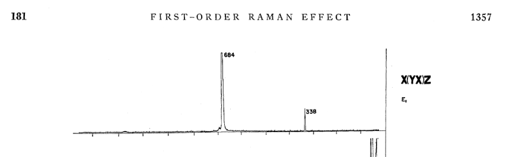

Raman spectra with TDEP
===

We have seen in [the infrared tutorial](../06_Infrared/) that light can couple to the motion of atoms (phonons) in the frequency range corresponding to the spectral range of phonons, which is typically several THz. Light in the visible range (>400 THz) will not directly couple to the phonons. However, it can still exchange quanta of energy with the phonons through variations in the permittivity: the Raman effect.

This tutorial covers the basics to compute temperature-dependent first-order Raman spectra with TDEP. 

What we need to compute is the Raman scattering cross section, Eq. (7) in Ref. [1], 

$$
\sigma(\Omega) \propto \sum_{\mu \nu \xi \rho} E_\mu^{\text {out }} E_{\xi}^{\text {out }} I_{\mu \nu, \xi \rho}(\Omega) E_\nu^{\text {in }} E_\rho^{\text {in }}
$$

which relates the intensity of incoming with with E-field vector ${\mathbf E}^\mathrm{in}$ to the intensity of the outgoing light with E-field vector ${\mathbf E}^\mathrm{out}$, where $\mu$, $\xi$, $\nu$, $\rho$ are Cartesian indices, and $I_{\mu \nu, \xi \rho}$ is the _Raman tensor_.

The Raman tensor is given by the susceptibility-susceptibility response function

$$
I_{\mu \nu, \xi \rho} (\Omega)
= \int \langle \chi_{\mu \nu} \chi_{\xi \rho} \rangle {\mathrm e}^{- \mathrm i \Omega t} \mathrm d t~,
$$

with the polarizability also known from the dielectric tensor

$$
\epsilon = \epsilon_0 ( 1 + \chi )
$$

in SI units, or

$$
\epsilon = 1 + 4 \pi \chi
$$

in atomic units.

In this tutorial, we will compute the Raman tensor by expanding the susceptibility to first order in the atomic displacements, i.e., the first-order dielectric response, Eq. (10) in [1], which we compute here by finite differences similar to Eq. (9) in Ref. [2]. By including anharmonicity, we can study the temperature dependence of the Raman spectrum as well, as well as polarization dependence.

In first order Raman, we only deal with 

$$
I^{\alpha \beta}_s = \frac{\partial \chi^{\alpha \beta}}{\partial u_s}~,
$$

i.e., the change of the susceptibility with _mode displacement_ $u_s$. The intensity contribution of mode $s$ at frequency $\omega$ for given polarization $\mathbf e_{\mathrm i}$ of incoming and $\mathbf e_\mathrm{o}$ for outgoing light will be given by

$$
\sigma_{s; \mathbf e_\mathrm{i}, \mathbf e_\mathrm{o}} (\omega) = \lvert \mathbf e_\mathrm{i} \cdot I_s \mathbf e_\mathrm{o} \rvert^2 J_s(\omega)~,
$$

with the spectral function $J_s$, which, of course, depends on temperature. There are a couple of approximations here that we go over, I refer to [[Benshalom2022, Benshalom2023]](#Suggested-reading) for a more complete treating. The full intensity will be given as a sum over modes:

$$
\sigma_{\mathbf e_\mathrm{i}, \mathbf e_\mathrm{o}} (\omega) 
= \sum_s \lvert \mathbf e_\mathrm{i} \cdot I_s \mathbf e_\mathrm{o} \rvert^2 J_s(\omega)~,
\tag{1}
$$

and this will be what experimentalists can measure. Mapping out the full dependency of the intensity as a function of the incoming/outgoing polarization is called _polarization-orientation (PO) Raman_. Eq. (1) is the topic of this tutorial.

### Note on orientation

To understand experimental Raman spectra for single crystals, we need to understand the _Porto notation_ [[Arguello1969]](#Suggested-reading):

<p>
	
  <figcaption><center><em>Figure from  <a href=#Suggested-reading>Ref. 4</a></em></center></figcaption>
</p>

This $X(YX)Z$ is to be read as:

- X: Direction of incoming light (its $\mathbf k$ vector)
- Y: Polarization of incoming light $\mathbf e_\mathrm{i}$
- X: Polarization of outgoing light $\mathbf e_\mathrm{o}$
- Z: Direction of outgoing light (its $\mathbf k$ vector)

#### Backscattering experiment

We will deal only with the most common type of experiment, the _backscattering experiment_, where incoming and outgoing light have the same direct, $\mathbf k_{\mathrm i} = - \mathbf{k}_{\mathrm o}$, denoted in Porto notation as, e.g., $Z (XY) \bar Z$.

## Outline

We will compute Raman spectra for wurtzite gallium nitride (GaN) and compare to the experimental reference in Ref. [[Siegle1995]](#suggested-reading).

## Preparation

- Have a converged set of 2nd and 3rd order force constants.

- Have a DFT code ready that can compute the dielectric tensor $\varepsilon$ for you.

- **We need the most recent version of ASE in order to be able to parse dielectric tensors**. Please make sure you have that installed, e.g., by running

  ```
  pip install git+https://gitlab.com/ase/ase.git@master
  ```

  The parsers will work for VASP, Quantum Espresso, and FHI-aims. For Quantum Espresso, please note the extra step explained in the `00_preparation/qe_dielectric_tensors` tutorial.

## Steps

We will start with backscattering in $z$ direction:

- Copy `infile.ucposcar`, `infile.lotosplitting` and the `infile.forceconstant` + `infile.forceconstant_thirdorder` into a folder `raman_z`

- Create the spectral functions with 
  ```bash
  lineshape --temperature 300 --qdirin 0 0 1
  ```

  this should give the file `outfile.phonon_self_energy.hdf5` that you already encountered.

- Now we create the mode displacements via
  ```bash
  tdep_displace_modes
  ```

  which will create positive and negative displacements for each mode, minus the acoustic ones, and write them to `outfile.ucposcar.mode.003.plus`, `outfile.ucposcar.mode.003.minus`, etc.

- **Now comes the DFPT part:** Convert these geometry files to the input of the DFT code of you choice which is capable of computing the dielectric tensor (Born charges are not needed, good luck FHI-aims users), and compute the dielectric tensor for each sample. I recommend to use a dedicated folder for this like before, let's say `samples`.

- When you are finished with all dielectric constants, parse them with e.g.
  ```bash
  cd samples
  tdep_parse_output sample.000*/qe.json
  ```

  in case [you are using Quantum Espresso](../00_preparation/qe_dielectric_tensors/README.md), other codes that should work out of the box are VASP and FHI-aims. If you are using another code, just make sure to write the dielectric tensors into a plain text file with 3 columns, similar to the `infile.lotosplitting`. Name the file `infile.dielectric_tensor` and copy or link it to your working directory `raman_z`.

  **If you cannot run DFPT at the moment, do not worry, and take the hidden input files in `07_Raman/example_GaN/.assets`.**

- Good, now we can compute the Raman tensors, and convolute them with the spectral functions, i.e., evaluate Eq. (1). There is a script to do this in several ways:

  ```bash
  tdep_compute_raman_intensities
  ```

  done.

## Analysis

Now we have several files:

- `outfile.mode_intensity.csv`: Gives the (isotropically averaged) intensity for each mode. Plot the intensities vs. harmonic frequencies, e.g.

  ```python
  import pandas as pd
  from matplotlib import pyplot as plt
  
  df = pd.read_csv("outfile.mode_intensity.csv", comment="#")
  
  fig, ax = plt.subplots()
  
  for imode, frequency in enumerate(df.frequency):
      ax.axvline(frequency, color="k", alpha=0.3)
      ax.scatter(frequency, df.intensity_raman.iloc[imode])
  ```

  This are harmonic Raman intensities as you would get them e.g. from Quantum Espresso directly.

- `outfile.intensity_raman.h5`: This contains the full (isotropically averaged) intensity, with temperature dependence (300K in our case). We furthermore get each mode contribution. You can plot the file e.g. with

  ```python
  import xarray as xr
  
  ds = xr.load_dataset('outfile.intensity_raman.h5')
  
  ds.intensity.to_series().plot()
  ```

  **Compare the resulting peak positions with the pure harmonic intensities from `outfile.mode_intensity.csv`:** What has changed? Why?

### Polarization orientation

You might have noticed that `tdep_compute_raman_intensities` dumps another file, `outfile.intensity_raman_po.h5`. This HDF5 file contains 2 PO maps. Read with `xarray`, you get

```python
ds_po = xr.load_dataset("outfile.intensity_raman_po.h5")
print(ds_po)
```

```
<xarray.Dataset>
Dimensions:        (angle: 361, frequency: 1200)
Coordinates:
  * angle          (angle) float64 0.0 1.0 2.0 3.0 ... 357.0 358.0 359.0 360.0
  * frequency      (frequency) float64 0.0 0.0426 0.0852 ... 50.99 51.03 51.08
Data variables:
    parallel       (angle, frequency) float64 0.0 1.797e-10 ... 0.0 0.0
    perpendicular  (angle, frequency) float64 0.0 1.463e-10 ... 0.0 0.0
Attributes:
    direction1:  [0. 0. 1.]
    direction2:  [1. 0. 0.]
    direction3:  [0. 1. 0.]
```

This is hopefully self-explanatory:

- Coordinates:
  - `angle`: PO orientation angle in 1 degree steps from 0 to 360
  - `frequency`: probing frequncy in THz
- Data variables:
  - `parallel`: Intensity for  $\mathbf e_{\mathrm i} \parallel \mathbf e_{\mathrm o}$
  - `perpendicular`: Intensity for  $\mathbf e_{\mathrm i} \perp \mathbf e_{\mathrm o}$
- Attributes:
  - the coordinate system, i.e. $\{ \mathbf k_\mathrm{i},  \mathbf e_{\mathrm i}, \mathbf e_{\mathrm o}\}$

**Task:** Plot the equivalent of the first 4 plots of Fig. 2b in [[Siegle1995]](#Suggested-reading) and discuss your findings.

## More things to do

- Rerun the Raman calculation for the x direction
- Plot the remaining 4 intensities of Fig. 2b in [Siegle1995].

Congratulations, you have performed a complete description of first-order Raman scattering in wurtzite GaN at room temperature from first principles.


## Suggested reading

- [[0]R. A. Cowley, P Phys Soc **84**, 281 (1964)](https://iopscience.iop.org/article/10.1088/0370-1328/84/2/311)
- [[1] N. Benshalom, G. Reuveni, R. Korobko, O. Yaffe, and O. Hellman, Phys Rev Mater **6**, 033607 (2022)](https://journals.aps.org/prmaterials/abstract/10.1103/PhysRevMaterials.6.033607)
- [[2] J. M. Skelton, L. A. Burton, A. J. Jackson, F. Oba, S. C. Parker, and A. Walsh, Phys Chem Chem Phys **19**, 12452 (2017)](https://pubs.rsc.org/en/content/articlelanding/2017/CP/C7CP01680H)  
- [[3] N. Benshalom et al., arxiv 2204.12528 (2023)](https://arxiv.org/abs/2204.12528)
- [[4]C. A. Arguello, D. L. Rousseau, and S. P. S. Porto, Phys Rev **181**, 1351 (1968)](https://journals.aps.org/pr/abstract/10.1103/PhysRev.181.1351)
- [[5]H. Siegle *et al.*, Solid State Commun. **96**, 943 (1995)](https://www.sciencedirect.com/science/article/pii/0038109895005617)

## Prerequisites

- [TDEP is installed](http://ollehellman.github.io/page/0_installation.html)
- [TDEP tools are installed](https://github.com/flokno/tools.tdep)
